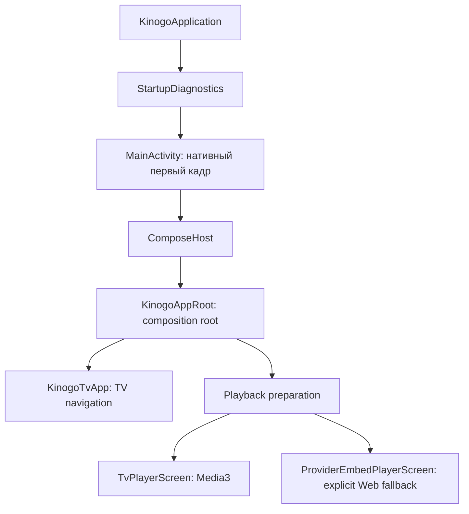
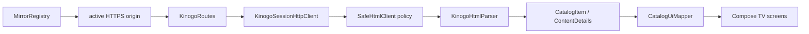
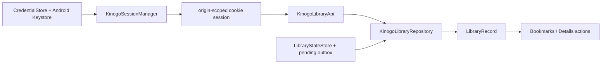
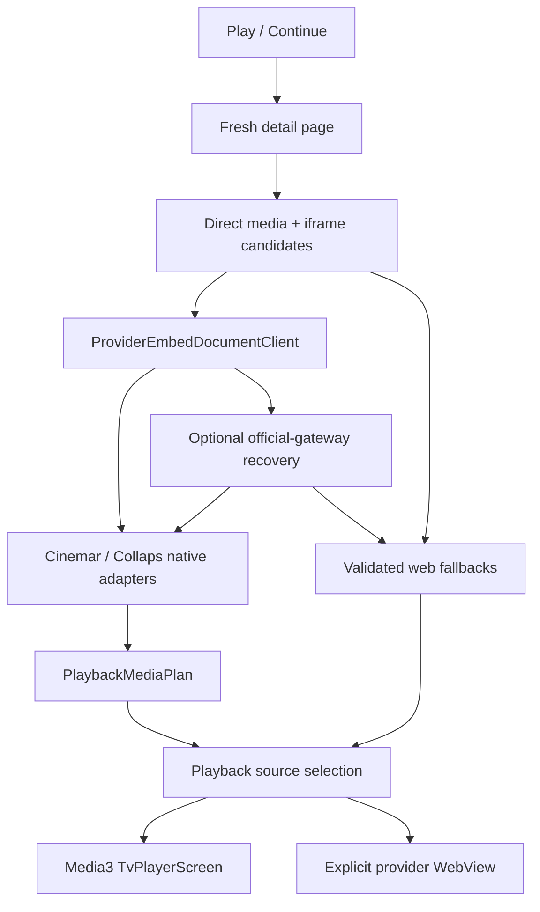

# Архитектура KinogoATV

Последнее обновление: **29 июля 2026 года**.

## Цели архитектуры

KinogoATV — TV-only приложение, которое:

- показывает нативный каталог вместо оболочки сайта;
- работает обычным D-pad-пультом;
- не привязывает данные пользователя к одному изменчивому домену;
- использует единый нативный Media3-плеер для явно разобранных источников;
- сохраняет web-плеер только как изолированный явный fallback;
- не ослабляет сетевую защиту ради доступности контента.

## Путь запуска



Ключевые файлы:

- `KinogoApplication.kt` — ранняя установка crash diagnostics и debug-настройка WebView;
- `MainActivity.kt` — нативный первый кадр, immersive mode, stall/error report и подключение
  Compose только после первого draw;
- `ComposeHost.kt` — жизненный цикл `ComposeView`;
- `KinogoAppRoot.kt` — ручная сборка зависимостей, orchestration и корневое состояние;
- `ui/KinogoTvApp.kt` — destinations, navigation rail, карточка и подтверждение выхода.

Нативный стартовый слой принципиален: ошибка Compose, storage или сети не должна выглядеть
как «пустое нажатие» на плитку Android TV.

## Текущая композиция

Проект состоит из одного Android-модуля `:app`. Hilt/Koin, Navigation Component и ViewModel
слой сейчас не используются. Объекты DataStore, repositories, parsers и coordinators
создаются через `remember` в `KinogoAppRoot`.

Это означает:

- lifecycle UI-состояния в основном принадлежит composition root;
- новый flow нельзя автоматически «положить во ViewModel», которой пока нет;
- перенос состояния из `KinogoAppRoot` должен быть отдельным контролируемым рефакторингом,
  а не побочным эффектом интерфейсной правки.

## Слои

| Слой | Каталоги | Ответственность |
| --- | --- | --- |
| Platform/bootstrap | корень package, `diagnostics/` | Activity, ранний draw, crash/stall recovery |
| UI | `ui/`, `player/ui/`, `player/web/` | Compose screens, TV focus, HUD, provider WebView |
| Orchestration | `KinogoAppRoot.kt` | Связывает repositories, storage, session и fullscreen flows |
| Domain | `domain/` | Host-independent модели и инварианты |
| Data | `data/*` | HTML/JSON parsers, repositories, DataStore, DNS, mirrors, adapters |
| Player core | `player/` | Reducer, key mapping, Media3 controller и safe data sources |

Зависимости должны идти к domain-моделям, а UI не должен разбирать HTML, provider JavaScript
или сетевые URL.

Визуальный контракт UI вынесен в [`UI_DESIGN.md`](UI_DESIGN.md). Текущая реализация
использует фиксированный тёмно-стальной navigation rail, более светлый стальной content
frame, бирюзовый focus/active color и общую шестиколоночную сетку постеров. Эти параметры
являются частью TV focus graph, а не только декоративной темой: произвольная замена размеров
или плавающая панель может сделать D-pad-переходы неоднозначными.

## Основные потоки данных

### Каталог



`CatalogItem.relativePath` не содержит домен. При смене зеркала тот же объект можно запросить
у нового origin. Асинхронные запросы защищены generation counters: старый ответ не может
заменить данные нового зеркала, раздела или поискового запроса.

`CatalogQuery` содержит `section`, `searchTerm`, один optional `CatalogFilter` и `page`.
Детерминированный маршрут может описывать только один из трёх режимов: верхний раздел,
текстовый поиск либо серверный GET-фильтр. Фильтр нельзя одновременно комбинировать с
поиском или верхним разделом. `CatalogFilter` сейчас покрывает новинки, год, страну и
allowlisted жанр; сортировка загруженных карточек остаётся локальной UI-операцией.

Production-пагинация сейчас координируется вручную в `KinogoAppRoot`; существующий
`HtmlCatalogPagingSource` не подключён к этому flow.

### Авторизация и библиотека



Credentials постоянны, cookie memory-only. Статус и independent favorite имеют отдельные
coalescing mutations, чтобы последняя команда переживала временную недоступность сервера.

### Воспроизведение



Все media/embed/subtitle URL живут только в памяти подготовленной сессии. История сохраняет
стабильный выбор и позицию, но не URL.

`PlaybackMediaPlan` также владеет последовательностью эпизодических координат. Переходы
Previous/Next сортируют реально существующие варианты по сезону и серии для текущих
источника и озвучки, пропускают отсутствующие сезоны/серии и тем самым одинаково работают
внутри сезона и на его границе. Runtime различает автоматический playlist transition,
`PLAY_WHEN_READY_CHANGE_REASON_END_OF_MEDIA_ITEM` при отключённом auto-next и финальный
`STATE_ENDED`; завершённый checkpoint сохраняется до смены выбранной серии.
`PlaybackCompletionPolicy` выбирает следующую совместимую координату либо завершает
fullscreen flow. Корневой callback этого flow возвращает пользователя в открытую карточку
материала.

### История

`PlaybackProgressStore` хранит `WatchProgress` по ключу:

```text
contentId + seasonId? + episodeId?
```

Запись содержит selection, position, duration, timestamp, ended и snapshot карточки.
`PlaybackProgressCodec` читает v1 и записывает v2. Snapshot обогащается атомарно, не
перезаписывая более новый checkpoint. `LegacyHistoryDetailsResolver` восстанавливает старые
numeric-only записи через строго ограниченные относительные пути.

## Владение состоянием

| Данные | Где живут | Срок |
| --- | --- | --- |
| Credentials | DataStore `kinogo_auth`, AES/GCM + Keystore | До явного удаления пользователем |
| История, библиотека, зеркала, TV-настройки | DataStore `kinogo_tv_state` | Между запусками |
| Cookies | `KinogoSessionHttpClient`, раздельно по origin | Текущий процесс/сессия |
| Каталог, details, UI selection | Compose state в `KinogoAppRoot` | Текущая composition |
| Prepared media/embed URLs | Redacted in-memory session | Только до закрытия/refresh плеера |
| Серверные статусы/избранное | HTML-сервис + локальный outbox | Синхронизируемые |

Auth DataStore исключён из Android backup и device transfer, потому что Keystore key
device-bound.

## Domain-инварианты

- `CatalogItem.id` стабилен в пределах адаптера; `relativePath` host-independent.
- Film и episodic variants не смешиваются в одном `PlaybackMediaPlan`.
- Комбинация source/season/episode/voiceover/quality уникальна.
- Для series сезон и серия либо присутствуют вместе, либо отсутствуют вместе.
- Сезоны и серии вычисляются из реально доступных вариантов выбранной озвучки.
- Previous/Next для series идут по упорядоченным реальным координатам выбранных source и
  voiceover и могут пересекать границу сезона.
- Естественное окончание последнего доступного варианта завершает player flow и возвращает
  в details; auto-next не создаёт несуществующую серию.
- `WatchProgress` не содержит transient URL.
- `WatchStatus? = null` — отсутствие статусной закладки, а не коллекция всех непросмотренных.
- `favorite` не зависит от status.
- Пользовательский manual mirror не становится trusted до fingerprint/health проверки.

## Точки расширения

### Новый раздел каталога

1. Добавить стабильный маршрут в `CatalogSection` и `KinogoRoutes`.
2. Добавить parser fixture и тест.
3. Обновить `CatalogScreen`, focus и preload tests.
4. Обновить `SERVICE_INTEGRATION`, `PROJECT_STATE`, `CHANGELOG`.

### Новый provider adapter

1. Создать `data/playback/<provider>/` с models/parser/adapter.
2. Разбирать только browser-visible данные без выполнения произвольного JS.
3. Проверить каждое media/subtitle destination через существующую public-DNS boundary.
4. Преобразовать в `PlaybackMediaPlan` через отдельный mapper.
5. Подключить в `KinogoPlaybackPreparationService`.
6. Добавить redacted fixtures и negative security tests.
7. Сохранить явный web fallback там, где native plan построить нельзя.

### Новый экран

Главная TV-навигация сейчас реализована enum `TvDestination` и `when` в `KinogoTvApp`.
Добавление destination требует rail item, focus contract, Back behavior и unit/UI tests.

## Технический долг

- `KinogoAppRoot.kt` слишком велик и совмещает composition, orchestration и use cases.
- Нет ViewModel/state-holder слоя и формализованного DI.
- Production catalog использует ручную пагинацию при наличии отдельного PagingSource.
- Поиск загружает одну страницу.
- Комбинации нескольких server-side filters и server-side sort не представлены в domain;
  одиночные GET-фильтры года, страны, жанра и новинок уже формализованы.
- `reduceMotion` применяется только к части Settings UI.
- Нет CI, dependency verification и автоматического clean-clone smoke test.

Рефакторинг этих пунктов не должен одновременно менять сетевой контракт или playback UX.
Сначала добавляется characterization test, затем переносится один поток, после чего
выполняется аппаратная проверка.
