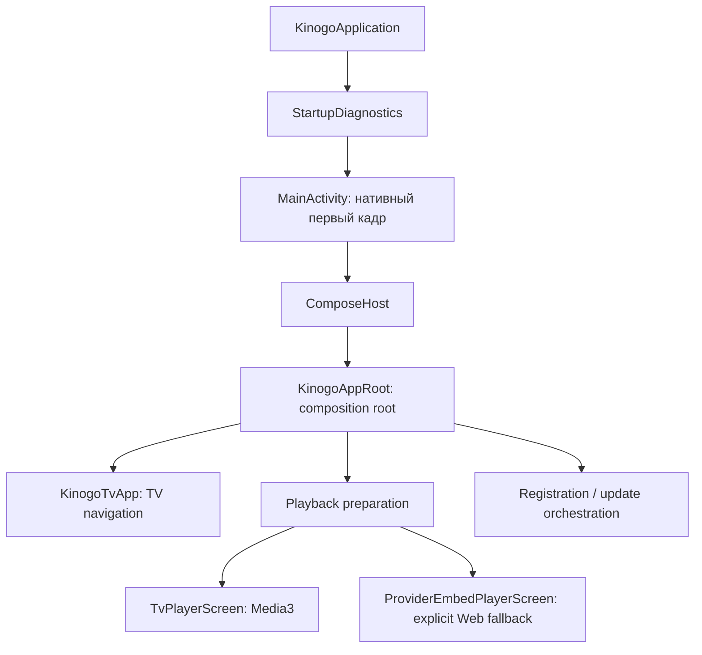
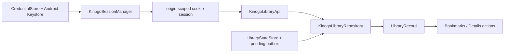
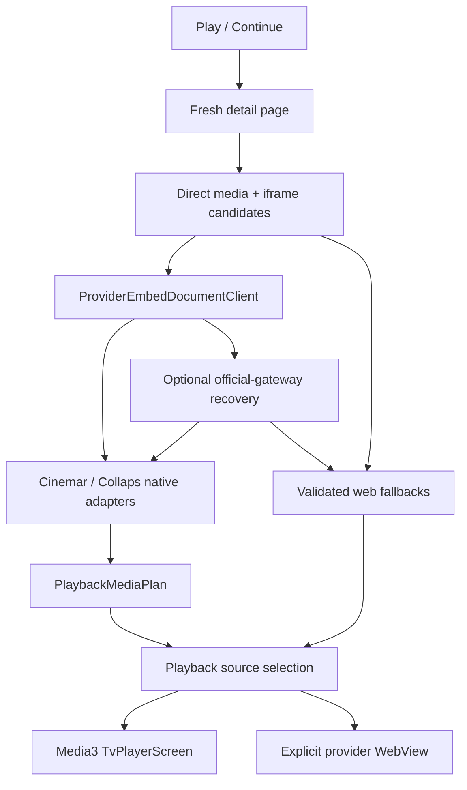

# Архитектура KinogoATV

Последнее обновление: **15 августа 2026 года**.

## Цели архитектуры

KinogoATV — TV-only приложение, которое:

- показывает нативный каталог вместо оболочки сайта;
- работает обычным D-pad-пультом;
- не привязывает данные пользователя к одному изменчивому домену;
- использует единый нативный Media3-плеер для явно разобранных источников;
- сохраняет web-плеер только как изолированный явный fallback;
- не ослабляет сетевую защиту ради доступности контента.

## Путь запуска



Ключевые файлы:

- `KinogoApplication.kt` — ранняя установка crash diagnostics и debug-настройка WebView;
- `MainActivity.kt` — нативный первый кадр, immersive mode, stall/error report и подключение
  Compose только после первого draw;
- `ComposeHost.kt` — жизненный цикл `ComposeView`;
- `KinogoAppRoot.kt` — ручная сборка зависимостей, orchestration и корневое состояние;
- `ui/KinogoTvApp.kt` — destinations, navigation rail, карточка и подтверждение выхода.

Нативный стартовый слой принципиален: ошибка Compose, storage или сети не должна выглядеть
как «пустое нажатие» на плитку Android TV.

## Текущая композиция

Проект состоит из одного Android-модуля `:app`. Hilt/Koin, Navigation Component и ViewModel
слой сейчас не используются. Объекты DataStore, repositories, parsers и coordinators
создаются через `remember` в `KinogoAppRoot`.

Это означает:

- lifecycle UI-состояния в основном принадлежит composition root;
- новый flow нельзя автоматически «положить во ViewModel», которой пока нет;
- перенос состояния из `KinogoAppRoot` должен быть отдельным контролируемым рефакторингом,
  а не побочным эффектом интерфейсной правки.

## Слои

| Слой | Каталоги | Ответственность |
| --- | --- | --- |
| Platform/bootstrap | корень package, `diagnostics/` | Activity, ранний draw, crash/stall recovery |
| UI | `ui/`, `player/ui/`, `player/web/` | Compose screens, TV focus, HUD, provider WebView |
| Orchestration | `KinogoAppRoot.kt` | Связывает repositories, storage, session и fullscreen flows |
| Domain | `domain/` | Host-independent модели и инварианты |
| Data | `data/*` | HTML/JSON parsers, repositories, DataStore, DNS, mirrors, adapters, update verifier |
| Player core | `player/` | Reducer, key mapping, Media3 controller и safe data sources |

Зависимости должны идти к domain-моделям, а UI не должен разбирать HTML, provider JavaScript
или сетевые URL.

Визуальный контракт UI вынесен в [`UI_DESIGN.md`](UI_DESIGN.md). Текущая реализация
использует фиксированный тёмно-стальной navigation rail, более светлый стальной content
frame, бирюзовый focus/active color и общую шестиколоночную сетку постеров. Эти параметры
являются частью TV focus graph, а не только декоративной темой: произвольная замена размеров
или плавающая панель может сделать D-pad-переходы неоднозначными.

## Основные потоки данных

### Каталог

```mermaid
flowchart LR
    A["MirrorRegistry"] --> B["active HTTPS origin"]
    B --> C["Home / Catalog / Search feed state"]
    C --> D["CatalogQuery + KinogoRoutes"]
    D --> E["HtmlCatalogRepository: serialized xSort"]
    E --> F["KinogoSessionHttpClient + safe HTML policy"]
    F --> G["KinogoHtmlParser"]
    G --> H["CatalogItem / CatalogControls"]
    H --> I["Shared TvPosterGrid"]
```



`CatalogItem.relativePath` не содержит домен. При смене зеркала тот же объект можно запросить
у нового origin. Асинхронные запросы защищены generation counters: старый ответ не может
заменить данные нового зеркала, раздела или поискового запроса.

`CatalogQuery` содержит optional allowlisted `CatalogCategory`, комбинируемый
`CatalogBrowseFilters`, optional `searchTerm` и `page`. Поиск остаётся отдельным
режимом и не смешивается с category/xSort-фильтрами. Категории фильмов и
сериалов хранят точные host-independent routes, а случайные href из HTML не
попадают в domain allowlist. Каталог по умолчанию открывает категорию `Новинки`.
Если xSort fragment не содержит sidebar, UI подставляет ровно полный allowlist из 28
`CatalogCategory.entries`; непустой разобранный subset используется без расширения.

Списки сортировки, подборки, года и страны разбираются из xSort-элементов
конкретной страницы. Выбор применяется сервером через POST xSort; направление
сортировки передаётся повторным выбором того же поля и имеет отдельную
кнопку в TV UI. xSort-состояние является session-wide, поэтому `HtmlCatalogRepository`
сериализует все browse/search-запросы через `Mutex`, очищает и восстанавливает
нужную выборку при переключении между лентами. Числовой cookie-session epoch инвалидирует
applied-query cache после login/reconnect, а финальное активное xSort-состояние сверяется с
явно запрошенными полями до append. Stateful DLE-потоки каталога, авторизации и библиотеки
используют `KinogoSessionHttpClient`, принудительно ограниченный HTTP/1.1: на реальном
Android TV HTTP/2-соединение зависало в ожидании response headers. Playback-клиенты отделены
от этой cookie-сессии и этим ограничением не изменяются.

Конкурентная смена cookie-session epoch запускает bounded retry всего catalog transaction.
Сетевой сбой допускает ровно одну такую же полную попытку: заново выполняются
`clearallfields` и все необходимые xSort-команды. Отдельный toggle POST никогда не
повторяется сам по себе, иначе сервер может незаметно перевернуть направление сортировки.
`appliedQuery` инвалидируется после сетевого сбоя, отмены coroutine и любой незавершённой
transaction; общий repository `Mutex` при этом сохраняется.

`KinogoAppRoot` владеет тремя независимыми `CatalogFeedState`: Home, Catalog и Search.
Каждая лента хранит собственные query, items, controls, `nextPage`, loading/error,
origin и generation. Дозагрузка главной, каталога и поиска сохраняет identity и
делает GET точного page-route в той же cookie-сессии. Общий `TvPosterGrid` задаёт
одинаковую шестиколоночную раскладку, стабильные D-pad-переходы и ранний
query-aware preload для всех трёх лент: следующая страница запрашивается, когда под строкой
фокуса остаётся меньше двух загруженных строк. Focus coroutine отменяется при смене identity
либо удалении её target, но не при обычном append, а offscreen-переход сдвигает viewport на
одну строку. Reset той же ленты отменяет её устаревший request job. При смене фильтра Home
или Catalog на том же origin прежние карточки и controls остаются видимыми до успешной
замены и при transient failure; Search и любая смена origin очищают старую выдачу.

Начальная загрузка имеет явный приоритет. После первой страницы Home автоматически цепляет
только строго возрастающие `nextPage`, пока `distinctBy(CatalogItem::id)` не даст минимум
18 карточек (`3 × 6`) либо сервер не исчерпает страницы. Невидимого прогрева Catalog больше
нет: он конкурировал с видимой лентой за общую stateful xSort-сессию. Первая страница
Catalog запрашивается только при явном входе пользователя, с неизменной default-категорией
`CatalogCategory.NEW_RELEASES` (`/novinki/`).

Home chain и прямой Catalog load создают отдельные coroutine requests, но не выполняют
xSort параллельно. Каждый `loadPage` проходит через общий `HtmlCatalogRepository` mutex,
потому что Home и Catalog меняют одну cookie-session. Поэтому прямой вход в Catalog может
дождаться завершения уже выполняющегося Home transaction, но запрос ставится в работу
сразу. После каждого переключения identity repository заново подтверждает активное
xSort-состояние, а generation/origin/query guards не позволяют позднему ответу смешать
ленты. Append не запрашивает Compose focus, поэтому не меняет текущую D-pad-позицию.

Production-пагинация по-прежнему координируется
вручную в `KinogoAppRoot`; `HtmlCatalogPagingSource` в этот flow не подключён.

### Авторизация и библиотека



Credentials постоянны, cookie memory-only. Статус и independent favorite имеют отдельные
coalescing mutations, чтобы последняя команда переживала временную недоступность сервера.

Registration использует тот же `KinogoSessionHttpClient`, но отдельный
`KinogoRegistrationApi`/`RegistrationHtmlParser`: отдельный DLE rules document и только
после explicit accept — same-origin account form, ephemeral hidden fields и image CAPTCHA
до 512 KiB. UI sensitive fields используют `remember`, не `rememberSaveable`; bitmap decode
ограничен dimensions/pixels/downsample. Root держит registration generation+origin guard,
поэтому late response не применяется после retry/dismiss/origin switch. После successful
submit root передаёт credentials в уже существующий encrypted `saveAndLogin`; нового
password store нет.

### Воспроизведение



Все media/embed/subtitle URL живут только в памяти подготовленной сессии. История сохраняет
стабильный выбор и позицию, но не URL.

`PlaybackMediaPlan` также владеет последовательностью эпизодических координат. Переходы
Previous/Next сортируют реально существующие варианты по сезону и серии для текущих
источника и озвучки, пропускают отсутствующие сезоны/серии и тем самым одинаково работают
внутри сезона и на его границе. Runtime различает автоматический playlist transition,
`PLAY_WHEN_READY_CHANGE_REASON_END_OF_MEDIA_ITEM` при отключённом auto-next и финальный
`STATE_ENDED`; завершённый checkpoint сохраняется до смены выбранной серии.
`PlaybackCompletionPolicy` выбирает следующую совместимую координату либо завершает
fullscreen flow. Корневой callback этого flow возвращает пользователя в открытую карточку
материала.

При Media3 error `TvPlayerScreen` может передать root хост-независимый
`PlaybackSourceRefreshRequest`: selection, checkpoint position и набор уже attempted
`contentId/season/episode` units. Root повторяет всю fresh preparation, нормализует
выбор по новому plan и создаёт replacement player. Attempt set переносится в
новую сессию, поэтому automatic refresh ограничен одним разом на playback unit и
не циклится между экранами. Position/automatic start сохраняются только если свежая
normalization оставила exact тот же content/season/episode; remap на другую единицу
возвращает пользователя в selector с position 0.

`PlaybackLaunchSafety` вычисляется до early prerequisites. При recovery consumed attempt
сразу записывается в current active session, а launch получает discard-on-exit. Missing
content, missing active mirror, Back или preparation failure очищают dead active/embed/
pending session и оставляют explicit error → Details route. `playbackLaunchGeneration`
блокирует late coroutine result, поэтому закрытый failing player не может воскреснуть с
утраченным attempt budget.

### История

`PlaybackProgressStore` хранит `WatchProgress` по ключу:

```text
contentId + seasonId? + episodeId?
```

Запись содержит selection, position, duration, timestamp, ended и snapshot карточки.
`PlaybackProgressCodec` читает v1 и записывает v2. Snapshot обогащается атомарно, не
перезаписывая более новый checkpoint. `LegacyHistoryDetailsResolver` восстанавливает старые
numeric-only записи через строго ограниченные относительные пути.

`preferredResumeProgress` одинаково обслуживает History, Catalog и Search: для content ID
выбирается newest unfinished eligible checkpoint, а не exact/default episode. Details получает
из него явный resume label с season/episode/position.

### Обновления и remote bootstrap

`AppUpdateManager` разделяет check, download+verify и передачу Android Package Installer.
`GitHubReleaseUpdateClient` принимает только canonical stable Release/asset, а
`ApkUpdateVerifier` до installer сверяет package/version/signing identity. APK живёт в app cache;
финальная установка всегда требует системного confirmation.

`MirrorBootstrapClient` читает bounded exact-schema `config/mirrors.json` с operator-controlled
GitHub raw path. Manifest не подписан и потому только добавляет quarantined discovery
candidates в `MirrorRegistry`; принятие origin остаётся за existing health checker. Snapshot
2026-08-15 содержит четыре origin, включая `kinogo.family`, без повышения trust.

## Владение состоянием

| Данные | Где живут | Срок |
| --- | --- | --- |
| Credentials | DataStore `kinogo_auth`, AES/GCM + Keystore | До явного удаления пользователем |
| История, библиотека, зеркала, TV-настройки | DataStore `kinogo_tv_state` | Между запусками |
| Cookies | `KinogoSessionHttpClient`, раздельно по origin | Текущий процесс/сессия |
| Registration rules/form/CAPTCHA/input | Память `KinogoRegistrationApi`/Compose `remember` | До accept/submit/refresh/dismiss |
| Каталог, details, UI selection | Compose state в `KinogoAppRoot` | Текущая composition |
| Prepared media/embed URLs | Redacted in-memory session | Только до закрытия/refresh плеера |
| Verified update APK | App-private cache `updates/` | До замены/очистки app cache |
| Серверные статусы/избранное | HTML-сервис + локальный outbox | Синхронизируемые |

Auth DataStore исключён из Android backup и device transfer, потому что Keystore key
device-bound.

## Domain-инварианты

- `CatalogItem.id` стабилен в пределах адаптера; `relativePath` host-independent.
- Film и episodic variants не смешиваются в одном `PlaybackMediaPlan`.
- Комбинация source/season/episode/voiceover/quality уникальна.
- Для series сезон и серия либо присутствуют вместе, либо отсутствуют вместе.
- Сезоны и серии вычисляются из реально доступных вариантов выбранной озвучки.
- Previous/Next для series идут по упорядоченным реальным координатам выбранных source и
  voiceover и могут пересекать границу сезона.
- Естественное окончание последнего доступного варианта завершает player flow и возвращает
  в details; auto-next не создаёт несуществующую серию.
- `WatchProgress` не содержит transient URL.
- `WatchStatus? = null` — отсутствие статусной закладки, а не коллекция всех непросмотренных.
- `favorite` не зависит от status.
- Пользовательский manual mirror не становится trusted до fingerprint/health проверки.
- Remote bootstrap origin тоже всегда начинает как `DISCOVERY + QUARANTINED`; unsigned
  manifest не меняет trust state.
- Automatic source refresh допускается один раз на `content/season/episode` и переносит
  attempted set в replacement flow; checkpoint применяется только к exact той же unit.
- Recovery early return обязан discard-ить dead player и показать explicit error; ordinary
  preparation не наследует это поведение.
- Registration rules никогда не принимаются автоматически; late async result обязан
  совпасть с текущими generation и origin.
- Update APK до Package Installer обязан пройти release digest/package/version/signer
  verification; установка остаётся системным user-confirmed действием.

## Точки расширения

### Новая категория каталога

1. Подтвердить маршрут в актуальном server-rendered HTML.
2. Добавить host-independent route в allowlist `CatalogCategory`.
3. Добавить parser fixture, route/parser test и focus/preload test dropdown/grid.
4. Обновить `SERVICE_INTEGRATION`, `PROJECT_STATE`, `CHANGELOG`.

### Новый provider adapter

1. Создать `data/playback/<provider>/` с models/parser/adapter.
2. Разбирать только browser-visible данные без выполнения произвольного JS.
3. Проверить каждое media/subtitle destination через существующую public-DNS boundary.
4. Преобразовать в `PlaybackMediaPlan` через отдельный mapper.
5. Подключить в `KinogoPlaybackPreparationService`.
6. Добавить redacted fixtures и negative security tests.
7. Сохранить явный web fallback там, где native plan построить нельзя.

### Новый экран

Главная TV-навигация сейчас реализована enum `TvDestination` и `when` в `KinogoTvApp`.
Добавление destination требует rail item, focus contract, Back behavior и unit/UI tests.

## Технический долг

- `KinogoAppRoot.kt` слишком велик и совмещает composition, orchestration и use cases.
- Нет ViewModel/state-holder слоя и формализованного DI.
- Production catalog использует ручную пагинацию при наличии отдельного PagingSource.
- xSort session-wide и потому требует общей сериализации даже при независимых UI feed
  states; разделение cookie sessions на browse/search пока не вводилось.
- `reduceMotion` применяется только к части Settings UI.
- GitHub Actions clean-clone workflow добавлен, но первый remote green run ещё pending;
  dependency verification и API 28 emulator/device smoke отсутствуют.

Рефакторинг этих пунктов не должен одновременно менять сетевой контракт или playback UX.
Сначала добавляется characterization test, затем переносится один поток, после чего
выполняется аппаратная проверка.
