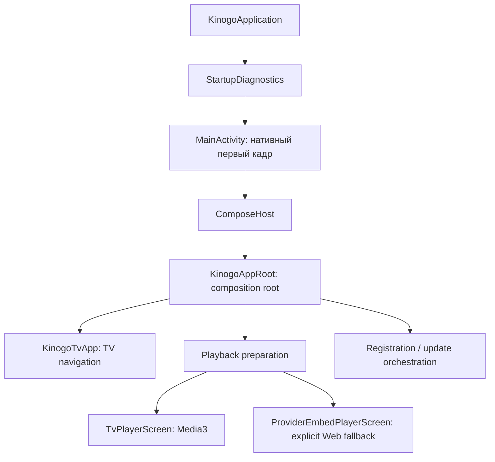
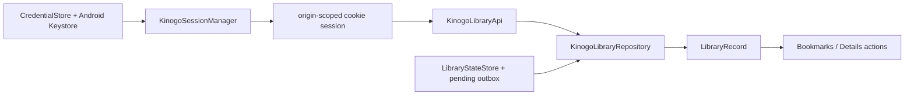
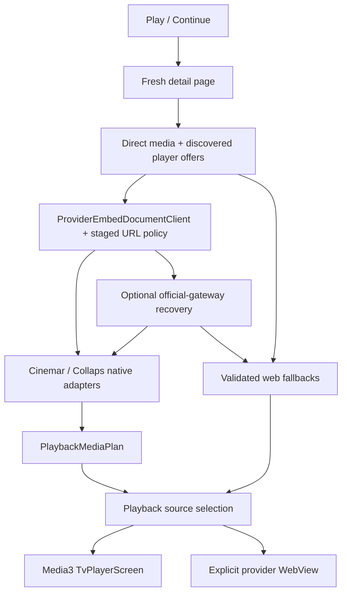

# Архитектура KinogoATV

Последнее обновление: **23 августа 2026 года**.

## Цели архитектуры

KinogoATV — TV-only приложение, которое:

- показывает нативный каталог вместо оболочки сайта;
- работает обычным D-pad-пультом;
- не привязывает данные пользователя к одному изменчивому домену;
- использует единый нативный Media3-плеер для явно разобранных источников;
- сохраняет web-плеер только как изолированный явный fallback;
- не ослабляет сетевую защиту ради доступности контента.

## Путь запуска



Ключевые файлы:

- `KinogoApplication.kt` — ранняя установка crash diagnostics и debug-настройка WebView;
- `MainActivity.kt` — нативный первый кадр, immersive mode, stall/error report и подключение
  Compose только после первого draw;
- `ComposeHost.kt` — жизненный цикл `ComposeView`;
- `KinogoAppRoot.kt` — ручная сборка зависимостей, orchestration и корневое состояние;
- `ui/KinogoTvApp.kt` — destinations, navigation rail, карточка и подтверждение выхода.

Нативный стартовый слой принципиален: ошибка Compose, storage или сети не должна выглядеть
как «пустое нажатие» на плитку Android TV.

## Текущая композиция

Проект состоит из одного Android-модуля `:app`. Hilt/Koin, Navigation Component и ViewModel
слой сейчас не используются. Объекты DataStore, repositories, parsers и coordinators
создаются через `remember` в `KinogoAppRoot`.

Это означает:

- lifecycle UI-состояния в основном принадлежит composition root;
- новый flow нельзя автоматически «положить во ViewModel», которой пока нет;
- перенос состояния из `KinogoAppRoot` должен быть отдельным контролируемым рефакторингом,
  а не побочным эффектом интерфейсной правки.

## Слои

| Слой | Каталоги | Ответственность |
| --- | --- | --- |
| Platform/bootstrap | корень package, `diagnostics/` | Activity, ранний draw, crash/stall recovery |
| UI | `ui/`, `player/ui/`, `player/web/` | Compose screens, TV focus, HUD, provider WebView |
| Orchestration | `KinogoAppRoot.kt` | Связывает repositories, storage, session и fullscreen flows |
| Domain | `domain/` | Host-independent модели и инварианты |
| Data | `data/*` | HTML/JSON parsers, repositories, DataStore, DNS, mirrors, adapters, update verifier |
| Player core | `player/` | Reducer, key mapping, Media3 controller и safe data sources |

Зависимости должны идти к domain-моделям, а UI не должен разбирать HTML, provider JavaScript
или сетевые URL.

Визуальный контракт UI вынесен в [`UI_DESIGN.md`](UI_DESIGN.md). Текущая реализация
использует фиксированный тёмно-стальной navigation rail, более светлый стальной content
frame, бирюзовый focus/active color и общую шестиколоночную сетку постеров. Эти параметры
являются частью TV focus graph, а не только декоративной темой: произвольная замена размеров
или плавающая панель может сделать D-pad-переходы неоднозначными.

## Основные потоки данных

### Каталог

```mermaid
flowchart LR
    A["MirrorRegistry"] --> B["active HTTPS origin"]
    B --> C["Home / Catalog / Search feed state"]
    C --> D["CatalogQuery + KinogoRoutes"]
    D --> E["HtmlCatalogRepository: serialized xSort"]
    E --> F["KinogoSessionHttpClient + safe HTML policy"]
    F --> G["KinogoHtmlParser"]
    G --> H["CatalogItem / CatalogControls"]
    H --> I["Shared TvPosterGrid"]
```



`CatalogItem.relativePath` не содержит домен. При смене зеркала тот же объект можно запросить
у нового origin. Асинхронные запросы защищены generation counters: старый ответ не может
заменить данные нового зеркала, раздела или поискового запроса.

`CatalogQuery` содержит optional allowlisted `CatalogCategory`, комбинируемый
`CatalogBrowseFilters`, optional `searchTerm` и `page`. Поиск остаётся отдельным
режимом и не смешивается с category/xSort-фильтрами. Категории фильмов и
сериалов хранят точные host-independent routes, а случайные href из HTML не
попадают в domain allowlist. Каталог по умолчанию открывает категорию `Новинки`.
Если xSort fragment не содержит sidebar, UI подставляет ровно полный allowlist из 28
`CatalogCategory.entries`; непустой разобранный subset используется без расширения.

Списки сортировки, подборки, года и страны разбираются из xSort-элементов
конкретной страницы. Выбор применяется сервером через POST xSort; направление
сортировки передаётся повторным выбором того же поля и имеет отдельную
кнопку в TV UI. xSort-состояние является session-wide, поэтому `HtmlCatalogRepository`
сериализует все browse/search-запросы через `Mutex`, очищает и восстанавливает
нужную выборку при переключении между лентами. Числовой cookie-session epoch инвалидирует
applied-query cache после login/reconnect, а финальное активное xSort-состояние сверяется с
явно запрошенными полями до append. Stateful DLE-потоки каталога, авторизации и библиотеки
используют `KinogoSessionHttpClient`, принудительно ограниченный HTTP/1.1: на реальном
Android TV HTTP/2-соединение зависало в ожидании response headers. Playback-клиенты отделены
от этой cookie-сессии и этим ограничением не изменяются.

Конкурентная смена cookie-session epoch запускает bounded retry всего catalog transaction.
Сетевой сбой допускает ровно одну такую же полную попытку: заново выполняются
`clearallfields` и все необходимые xSort-команды. Отдельный toggle POST никогда не
повторяется сам по себе, иначе сервер может незаметно перевернуть направление сортировки.
`appliedQuery` инвалидируется после сетевого сбоя, отмены coroutine и любой незавершённой
transaction; общий repository `Mutex` при этом сохраняется.

`KinogoAppRoot` владеет тремя независимыми `CatalogFeedState`: Home, Catalog и Search.
Каждая лента хранит собственные query, items, controls, `nextPage`, loading/error,
origin и generation. Дозагрузка главной, каталога и поиска сохраняет identity и
делает GET точного page-route в той же cookie-сессии. Общий `TvPosterGrid` задаёт
одинаковую шестиколоночную раскладку, стабильные D-pad-переходы и ранний
query-aware preload для всех трёх лент: следующая страница запрашивается, когда под строкой
фокуса остаётся меньше двух загруженных строк. Focus coroutine отменяется при смене identity
либо удалении её target, но не при обычном append, а offscreen-переход сдвигает viewport на
одну строку. Reset той же ленты отменяет её устаревший request job. При смене фильтра Home
или Catalog на том же origin прежние карточки и controls остаются видимыми до успешной
замены и при transient failure; Search и любая смена origin очищают старую выдачу.

Root также владеет stable ID последней сфокусированной карточки отдельно для Home,
Catalog, Search, Bookmarks и History. Общая сетка восстанавливает preferred ID только если
он ещё присутствует в текущей identity; иначе применяется обычный first-item/input focus.
Append не сбрасывает preferred target, а смена category/filter/query обнуляет только ID
соответствующей ленты. Поэтому Details Back возвращает не только destination/state, но и
точную non-first карточку.

Начальная загрузка имеет явный приоритет. После первой страницы Home автоматически цепляет
только строго возрастающие `nextPage`, пока `distinctBy(CatalogItem::id)` не даст минимум
18 карточек (`3 × 6`) либо сервер не исчерпает страницы. Невидимого прогрева Catalog больше
нет: он конкурировал с видимой лентой за общую stateful xSort-сессию. Первая страница
Catalog запрашивается только при явном входе пользователя, с неизменной default-категорией
`CatalogCategory.NEW_RELEASES` (`/novinki/`).

Home chain и прямой Catalog load создают отдельные coroutine requests, но не выполняют
xSort параллельно. Каждый `loadPage` проходит через общий `HtmlCatalogRepository` mutex,
потому что Home и Catalog меняют одну cookie-session. Поэтому прямой вход в Catalog может
дождаться завершения уже выполняющегося Home transaction, но запрос ставится в работу
сразу. После каждого переключения identity repository заново подтверждает активное
xSort-состояние, а generation/origin/query guards не позволяют позднему ответу смешать
ленты. Append не запрашивает Compose focus, поэтому не меняет текущую D-pad-позицию.

Production-пагинация по-прежнему координируется
вручную в `KinogoAppRoot`; `HtmlCatalogPagingSource` в этот flow не подключён.

### Авторизация и библиотека



Credentials постоянны, cookie memory-only. Статус и independent favorite имеют отдельные
coalescing mutations, чтобы последняя команда переживала временную недоступность сервера.

Registration использует тот же `KinogoSessionHttpClient`, но отдельный
`KinogoRegistrationApi`/`RegistrationHtmlParser`: отдельный DLE rules document и только
после explicit accept — same-origin account form, ephemeral hidden fields и image CAPTCHA
до 512 KiB. UI sensitive fields используют `remember`, не `rememberSaveable`; bitmap decode
ограничен dimensions/pixels/downsample. Root держит registration generation+origin guard,
поэтому late response не применяется после retry/dismiss/origin switch. После successful
submit root передаёт credentials в уже существующий encrypted `saveAndLogin`; нового
password store нет.

### Воспроизведение



Все media/embed/subtitle URL живут только в памяти подготовленной сессии. История сохраняет
стабильный выбор и позицию, но не URL.

Cinemar разделяет URL policy по стадии. Новый offer проходит только exact-host
`/embed/...` discovery. Уже найденный authenticated player document может использовать
непрозрачный runtime path exact `cinemar.cc`; `validatedPlayerDocumentUri` допускает только
non-root/non-`/api/` HTTPS path без query/fragment/userinfo и нестандартного порта. Fixed
same-origin `/api/playlist/load` строится отдельно и не наследуется из runtime route. При
same-origin redirect native config остаётся связан с исходным validated offer; explicit
Web fallback использует validated resolved document.

`PlaybackMediaPlan` может владеть optional `PlaybackMediaUrlResolver`. Cinemar использует
его для session-owned opaque leaf: mapper кладёт в variant только случайную локальную URI,
а Media3 `ResolvingDataSource` лениво получает HLS при первом open. Resolver memoize-ит одну
попытку на leaf, не является global singleton и освобождается вместе с plan, поэтому token не
попадает в persistent domain model и не переживает playback session. Grant client не
переносит cookies, не следует redirect и не повторяет POST после неоднозначного transport
failure; один success/failure memoize-ится внутри plan.

`PlaybackMediaPlan` также владеет последовательностью эпизодических координат.
`episodeCoordinatesFor` разворачивает все реально существующие серии всех совместимых
сезонов выбранных source/voiceover в один упорядоченный Media3 playlist. Previous/Next и
автоматический переход поэтому используют один порядок, пропускают отсутствующие номера и
одинаково пересекают границу сезона без замены playlist. Runtime различает автоматический
playlist transition, `PLAY_WHEN_READY_CHANGE_REASON_END_OF_MEDIA_ITEM` при отключённом
auto-next и финальный `STATE_ENDED`; завершённый checkpoint сохраняется до активации
следующей серии. После последней реальной coordinate fullscreen flow возвращает пользователя
в открытую карточку материала.

Предзагрузка использует только штатную `ExoPlayer.PreloadConfiguration` и ограничена
непосредственно следующим playlist item. Gate открывается только для episodic playback с
включённым auto-next, `playWhenReady=true` и без suppression: до конца осталось не больше
target buffer `T`, а `bufferedPosition >= duration - 500 ms`. Target следующей item равен
2,5 с для `T=5` и 5 с для `T=10/15/20/30`. Pause, suppression, close/transition и seek назад
disarm-ят preload; после seek назад он не включается повторно до прежней позиции. Media3
открывает item в памяти через тот же session-owned resolver/data-source factory, поэтому
для Cinemar текущий leaf разрешается при обычном open, а immediate-next leaf — лишь
оппортунистически после прохождения gate. Тот же механизм работает на границе сезона;
отдельного cross-season warmup или resolver fan-out нет. Disk cache не используется. URL,
grant и token не сохраняются, не логируются и не раскрываются через `MediaItem`.

Нефатальный `onLoadError` exact immediate-next window только помечает раннюю загрузку как
degraded и отключает preload: recovery budget текущей серии не расходуется. Terminal
`onPlayerError` будущей window запоминается, но fresh recovery запускается лишь если exact
window с теми же playlist generation/index/variant действительно стала текущей. События
старой generation, другой item или слишком далёкой future window игнорируются.

`TvPreferences.playbackBufferSeconds` хранит target `T` из allowlist
`5/10/15/20/30` секунд, default — 15. `PlaybackBufferPolicy` действительно передаёт его в
Media3 `DefaultLoadControl`: `minBufferMs = maxBufferMs = T * 1000`, start threshold —
`(T * 1000 / 3).coerceIn(1000, 2500)`, after-rebuffer threshold —
`(T * 1000 / 2).coerceIn(2000, 5000)`, `prioritizeTimeOverSizeThresholds=true`.
Та же configuration задаёт
`nextEpisodePreloadMs = (T * 1000 / 2).coerceIn(2000, 5000)` и передаёт
`targetPreloadDurationUs = nextEpisodePreloadMs * 1000` в Media3.
Preference входит в identity player host, поэтому её изменение создаёт новую Media3-сессию,
а не оставляет старый LoadControl.

В C-008 один recovery-flow обслуживает и явную ошибку Media3, и длительное отсутствие
прогресса. `PlaybackStallWatchdog` использует тот же target: initial buffering timeout —
`max(20, T)` секунд, rebuffer timeout — `T.coerceIn(5, 10)` секунд, а `READY` без движения
позиции — 15 секунд. Явный source error во время buffering передаётся recovery немедленно,
не дожидаясь watchdog timeout. Watchdog не работает, когда пользователь поставил паузу,
`playWhenReady=false`, playback подавлен системой либо Media3 находится в `IDLE`/`ENDED`.
Близость позиции к известному концу не является completion: near-end `READY`/`BUFFERING`
без прогресса проходит обычный recovery timeout до фактического `ENDED`. Один watchdog
выдаёт сигнал только один раз.

`TvPlayerScreen` передаёт root хост-независимый `PlaybackSourceRefreshRequest`: selection,
checkpoint position и набор уже attempted `contentId/season/episode` units. Root повторяет
всю fresh preparation, нормализует выбор по новому plan и обязательно увеличивает
`ActivePlaybackSession.generation`. Generation входит в identity player host, поэтому даже
структурно совпавший свежий plan создаёт новый Media3/ExoPlayer, а не продолжает зависшую
сессию. Attempt set переносится в replacement flow: automatic refresh ограничен одной
попыткой на playback unit и не циклится между экранами. Position/automatic start
сохраняются только если свежая normalization оставила exact тот же
content/season/episode; remap на другую единицу возвращает пользователя в selector с
position 0. Отдельной ручной кнопки обновления источника в native HUD нет: после
исчерпания автоматической попытки пользователь возвращается в Details и запускает новый
полный discovery действием «Смотреть».

Желаемое качество и реально загруженный variant/Media3 track — разные состояния.
`PlaybackQualityPolicy` сохраняет выбранное пользователем ограничение между сериями и
разрешает его против объединённого набора fixed variants и конкретных adaptive tracks:
сначала точное разрешение, затем максимальное не выше ограничения, а если все варианты
выше — минимальное доступное выше ограничения. `Auto` остаётся отдельным намерением и не
перезаписывает сохранённый fixed cap фактически выбранным потоком.
При смене intent MediaItems всех будущих серий перестраиваются до следующего preload;
текущие variant/reference, индекс, позиция и play state сохраняются, а stale preload/error
и async generations инвалидируются.

`PlaybackLaunchSafety` вычисляется до early prerequisites. При recovery consumed attempt
сразу записывается в current active session, а launch получает discard-on-exit. Missing
content, missing active mirror, Back или preparation failure очищают dead active/embed/
pending session и оставляют explicit error → Details route. `playbackLaunchGeneration`
блокирует late coroutine result, поэтому закрытый failing player не может воскреснуть с
утраченным attempt budget.

### История

`PlaybackProgressStore` хранит `WatchProgress` по ключу:

```text
contentId + seasonId? + episodeId?
```

Запись содержит selection, position, duration, timestamp, явный `playbackEnded` и snapshot
карточки. Completion не выводится только из последней позиции: отдельный end-сигнал не
должен быть потерян при закрытии или смене серии. `PlaybackProgressCodec` читает v1 и
записывает v2. Snapshot обогащается атомарно, не перезаписывая более новый checkpoint.
`LegacyHistoryDetailsResolver` восстанавливает старые numeric-only записи через строго
ограниченные относительные пути.

`preferredResumeProgress` одинаково обслуживает History, Catalog и Search: для content ID
сначала определяется самая новая активная единица, включая только что выбранную серию с
позиции 0. Если эта newest запись завершена, Continue отсутствует: policy не откатывается к
более старой незавершённой серии. Details получает явный resume label с
season/episode/position; для нулевой позиции он указывает S/E без фиктивного `0:00`.

Checkpoint callback несёт explicit end-state и generation активной Media3-сессии. Root
отбрасывает callback прежней generation, публикует актуальную запись в UI синхронно, а
durable DataStore writes выполняет последовательной `PlaybackCheckpointWriteQueue`.
Timestamp выдаётся монотонно относительно памяти и хранилища; `upsert` не позволяет поздней
старой записи затереть новую. Перед вычислением Continue root ждёт очередь и объединяет
memory snapshot с DataStore, поэтому немедленный выход и повторное «Продолжить» видят одну
и ту же последнюю серию/позицию.

### Обновления и remote bootstrap

`AppUpdateManager` разделяет check, download+verify и передачу Android Package Installer.
`DefaultAppUpdateClientFactory` сначала проверяет до четырёх APK-signer-authenticated signed
manifest endpoints, затем использует `GitHubReleaseUpdateClient` как fallback. Signed payload
задаёт exact version/name/size/SHA/expiry и до четырёх HTTPS APK locations; публичный ключ
берётся из сертификата установленного APK. `ApkUpdateVerifier` до installer повторно сверяет
package/version/signing identity. APK живёт в app cache; финальная установка всегда требует
системного confirmation.

`MirrorBootstrapClient` читает bounded exact-schema `config/mirrors.json` с operator-controlled
GitHub raw path. Manifest не подписан и потому только добавляет quarantined discovery
candidates в `MirrorRegistry`; принятие origin остаётся за existing health checker. Snapshot
2026-08-15 содержит четыре origin, включая `kinogo.family`, без повышения trust.

## Владение состоянием

| Данные | Где живут | Срок |
| --- | --- | --- |
| Credentials | DataStore `kinogo_auth`, AES/GCM + Keystore | До явного удаления пользователем |
| История, библиотека, зеркала, TV-настройки | DataStore `kinogo_tv_state` | Между запусками |
| Cookies | `KinogoSessionHttpClient`, раздельно по origin | Текущий процесс/сессия |
| Registration rules/form/CAPTCHA/input | Память `KinogoRegistrationApi`/Compose `remember` | До accept/submit/refresh/dismiss |
| Каталог, details, UI selection и per-destination focused IDs | Compose state в `KinogoAppRoot` | Текущая composition |
| Prepared media/embed URLs, Cinemar grant token, actual variant/track | Redacted session-owned media plan/player generation | Только до закрытия/refresh плеера |
| Desired playback quality | Stable selection/checkpoint; отдельно от actual stream | Между сериями и повторным resume |
| Playback buffer target | DataStore TV preferences; allowlist 5/10/15/20/30 секунд | Между запусками |
| Verified update APK | App-private cache `updates/` | До замены/очистки app cache |
| Серверные статусы/избранное | HTML-сервис + локальный outbox | Синхронизируемые |

Auth DataStore исключён из Android backup и device transfer, потому что Keystore key
device-bound.

## Domain-инварианты

- `CatalogItem.id` стабилен в пределах адаптера; `relativePath` host-independent.
- Preferred poster focus принадлежит конкретной destination/feed identity и сбрасывается при
  смене её category/filter/query, но не при обычном append или Details round-trip.
- Film и episodic variants не смешиваются в одном `PlaybackMediaPlan`.
- Комбинация source/season/episode/voiceover/quality уникальна.
- Для series сезон и серия либо присутствуют вместе, либо отсутствуют вместе.
- Сезоны и серии вычисляются из реально доступных вариантов выбранной озвучки.
- Previous/Next для series идут по упорядоченным реальным координатам выбранных source и
  voiceover и могут пересекать границу сезона.
- Естественное окончание последнего доступного варианта завершает player flow и возвращает
  в details; auto-next не создаёт несуществующую серию.
- `WatchProgress` не содержит transient URL.
- `WatchStatus? = null` — отсутствие статусной закладки, а не коллекция всех непросмотренных.
- `favorite` не зависит от status.
- Пользовательский manual mirror не становится trusted до fingerprint/health проверки.
- Remote bootstrap origin тоже всегда начинает как `DISCOVERY + QUARANTINED`; unsigned
  manifest не меняет trust state.
- Automatic source refresh допускается один раз на `content/season/episode` и переносит
  attempted set в replacement flow; checkpoint применяется только к exact той же unit, а
  replacement всегда получает новую Media3 session generation.
- Stall recovery применяется только при намерении реально воспроизводить: pause, playback
  suppression и неактивные `IDLE`/`ENDED` исключены, но near-end `READY`/`BUFFERING` без
  прогресса остаётся recoverable до true `ENDED`; timeouts выводятся из выбранного buffer
  target, а явная source error восстанавливается сразу.
- Buffer preference обязана конфигурировать реальный `DefaultLoadControl`; смена значения
  пересоздаёт player identity. UI-only подпись без изменения Media3 недопустима.
- Episodic playlist содержит все совместимые сезоны, но Media3 prefetch разрешает только
  immediate next item с bounded duration из buffer policy. Нельзя добавлять отдельный
  resolver fan-out, disk cache либо сохранять/логировать grant и конечный URL.
- Desired fixed quality не заменяется actual variant/track; выбор следует порядку
  exact → highest not above cap → lowest above cap и учитывает adaptive и fixed кандидаты
  совместно.
- Новая выбранная серия получает checkpoint с position 0; newest completed unit запрещает
  скрытый fallback к более старой незавершённой записи.
- Recovery early return обязан discard-ить dead player и показать explicit error; ordinary
  preparation не наследует это поведение.
- Registration rules никогда не принимаются автоматически; late async result обязан
  совпасть с текущими generation и origin.
- Update APK до Package Installer обязан пройти release digest/package/version/signer
  verification; установка остаётся системным user-confirmed действием.
- Cinemar discovery `/embed/...`, already discovered exact-host runtime document и fixed
  `/api/playlist/load` — три разные policy; runtime validator нельзя использовать как общий
  provider/API allowlist.

## Точки расширения

### Новая категория каталога

1. Подтвердить маршрут в актуальном server-rendered HTML.
2. Добавить host-independent route в allowlist `CatalogCategory`.
3. Добавить parser fixture, route/parser test и focus/preload test dropdown/grid.
4. Обновить `SERVICE_INTEGRATION`, `PROJECT_STATE`, `CHANGELOG`.

### Новый provider adapter

1. Создать `data/playback/<provider>/` с models/parser/adapter.
2. Разбирать только browser-visible данные без выполнения произвольного JS.
3. Проверить каждое media/subtitle destination через существующую public-DNS boundary.
4. Преобразовать в `PlaybackMediaPlan` через отдельный mapper.
5. Подключить в `KinogoPlaybackPreparationService`.
6. Добавить redacted fixtures и negative security tests.
7. Сохранить явный web fallback там, где native plan построить нельзя.

### Новый экран

Главная TV-навигация сейчас реализована enum `TvDestination` и `when` в `KinogoTvApp`.
Добавление destination требует rail item, focus contract, Back behavior и unit/UI tests.

## Технический долг

- `KinogoAppRoot.kt` слишком велик и совмещает composition, orchestration и use cases.
- Нет ViewModel/state-holder слоя и формализованного DI.
- Production catalog использует ручную пагинацию при наличии отдельного PagingSource.
- xSort session-wide и потому требует общей сериализации даже при независимых UI feed
  states; разделение cookie sessions на browse/search пока не вводилось.
- `reduceMotion` применяется только к части Settings UI.
- GitHub Actions clean-clone workflow добавлен, но первый remote green run ещё pending;
  dependency verification и API 28 emulator/device smoke отсутствуют.

Legacy `cycle`/`SettingCycleDirection` для Settings удалён в C-008. Изменение настройки идёт
только через stable `settingId + optionId`: boolean-пункты передают состояние switch, enum
и числовые значения, включая buffer target, — выбранный пункт dropdown. Это устраняет
скрытую зависимость значения от Left/Right и оставляет D-pad directions навигации.

Рефакторинг этих пунктов не должен одновременно менять сетевой контракт или playback UX.
Сначала добавляется characterization test, затем переносится один поток, после чего
выполняется аппаратная проверка. Для C-008 аппаратное evidence отсутствует:
recovery/resume/quality/buffer/prefetch на реальном TV остаются **PENDING**. ADB,
установка APK и аппаратный smoke выполняются только после отдельного разрешения владельца
на конкретный узкий сценарий, когда результат нельзя надёжно установить review и тестами.
