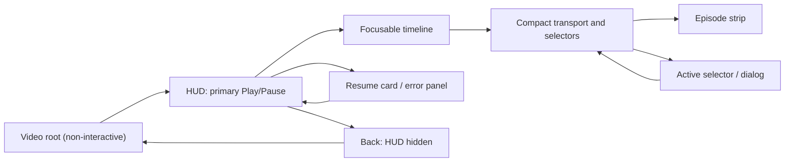

# Native Media3 player for Android TV — UX specification

> **Статус документа:** это целевая UX-спецификация и исторический план, а не перечень
> полностью реализованных функций. Актуальное production-поведение зафиксировано в
> [`PLAYBACK.md`](PLAYBACK.md) и [`PROJECT_STATE.md`](PROJECT_STATE.md). В частности,
> resume-card, визуальный countdown следующей серии, часть bounded failover и accessibility
> announcements ещё остаются в roadmap.

## Purpose and boundaries

This is a TV-first native player that aims for the *ease* of a mature media-centre player: immediate playback, predictable remote control, quick source/episode changes and recovery without losing the viewing position. It is an original interaction design, not a copy of LazyMedia Deluxe UI, artwork, labels or navigation.

`TvPlayerScreen` remains the native Media3 surface for an already resolved, documented HLS/DASH/MP4 stream. It must not parse provider HTML, run provider JavaScript, persist signed URLs, or accept an arbitrary WebView URL. `CinemarEmbedPlayerScreen` remains an isolated, provider-owned WebView fallback; its URL policy, network validation and blocked external navigation remain mandatory.

The target floor is API 28. Use Media3/ExoPlayer, Compose focus APIs and `MediaSession`; do not require Picture-in-Picture, custom codecs, a hardware keyboard, touch input, or Android TV APIs introduced after 28 for the core flow.

## Player screen and overlays

### Base playback

* Full-screen `PlayerView` has no built-in controller and never receives focus. It shows video and Media3 captions; Compose owns every visible interactive control.
* Start playback as soon as the preferred playable variant is available. When a saved position qualifies, first show a small non-blocking resume card for 6 seconds: **Continue from 23:41** (primary), **Start over**, and **Cancel**. Primary is pre-focused. A cancelled/expired card resumes; an explicit Start over seeks to zero.
* Initial quality follows `TvPreferences.defaultQuality`; subtitles follow the System/On/Off preference, and auto-next follows `autoNextEpisode`. An explicit in-session selection wins for the current playback unit but does not silently rewrite global preferences.
* Playback starts with unobstructed video. HUD is displayed after an explicit open action,
  buffering, error or an episode transition. It autohides after 4 seconds only while playing and
  while no drawer/dialog is open; on pause it remains visible.

### HUD

The HUD is an original two-zone overlay: a subtle dark gradient rather than a copy of another product's chrome.

* **Top:** back, title, current source name, and compact `S2 · E5 · Dub · 1080p · CC` metadata. Show a source trust/status glyph only as text for accessibility (for example, “native direct stream”).
* **Bottom:** elapsed/duration and a focusable seek bar; one compact horizontally
  scrollable row containing graphical Previous episode, Play/Pause, Next episode,
  **Season**, **Audio/translation**, **Quality**, **Subtitles**, **Source** and validated
  **Web player** actions. Rewind/forward buttons are deliberately omitted because the
  focused timeline and hardware keys already provide seeking.
* **Last row for episodic content:** a horizontally focusable episode strip filtered by
  the current source, translation and season. It is always below the controls, so a separate
  **Episodes** quick-action button is unnecessary.
* Use 48 dp minimum touch target and a 3 dp high-contrast focus outline. The focused item must be visually distinct from the selected item; selected choices receive a check mark but do not steal focus.
* Display temporary feedback close to the timeline: `+30 sec`, `Quality: 720p`, `No next episode`, `Trying backup source`. Do not make toasts the only error channel.

### Drawers and dialogs

Open selectors as a right-side modal panel over paused or playing video (do not pause automatically). The scrim is non-focusable. Back returns to the invoking HUD control and preserves playback.

1. **Source** — provider/source cards: label, native/Web badge, availability, selected state, and short failure note. Native direct sources rank before provider Web sources; user order is never overwritten during a session.
2. **Season** — only for serials, horizontal chips or a compact vertical list. Changing season keeps the chosen translation where available and opens the episode panel.
3. **Episode** — a numbered grid/list with watched state, progress bar, duration if known, and “next” marker. Numeric entry remains a fast path; it is additive, not the only way to reach an episode.
4. **Translation/audio** — display provider label as supplied. Selecting one retains the current quality if that combination exists, otherwise picks the source's preferred quality and announces the substitution.
5. **Quality** — `Auto` first, then available representations ordered high to low. A choice is selectable only when its exact current source/season/episode/translation tuple resolves. During adaptive HLS/DASH, a quality choice is a track constraint; otherwise it is a new variant.
6. **Subtitles** — `System`, `Off`, then the actual Media3 text tracks with language/forced/CC labels. If the source has no captions, keep `Off` and explain why; never present a nonfunctional selector.

The current `PlayerDrawer` already covers episode, voiceover, quality and on/off subtitles. Add season, source and real text-track data without making provider page controls part of the native player.

## Remote and media-key contract

This table defines the target behaviour for a simple TV remote. `ACTION_DOWN` is handled; left/right and rewind/fast-forward may repeat. Volume/power are passed to the system. Media keys are owned once through `MediaSession`, avoiding duplicate Media3 actions.

| Key | Video only / HUD hidden | HUD visible | Drawer, dialog, or error |
| --- | --- | --- | --- |
| D-pad Up / Down | Show HUD and focus Play/Pause | Move between HUD rows; at edge remain in the row | Move within active panel/list |
| D-pad Left / Right | Seek -/+ configured step, show HUD and focus the timeline | Move focus horizontally; on timeline seek -/+ step | Change focused chip/option; never seek underneath |
| OK / Enter / A | Show HUD and focus Play/Pause | Invoke focused control; default Play/Pause toggles | Select/confirm focused option |
| Back / Escape / B | Exit player after checkpoint | Hide HUD | Close topmost panel/dialog; on error use focused Back action |
| Menu | Show HUD, then focus Quick actions | Open/close Quick actions | Close topmost panel |
| Play / Pause / Play-Pause / headset | Play, pause, toggle respectively | Same; bypasses focused drawer | Same; it must work even when a selector owns focus |
| FF / Skip forward, Rewind / Skip backward | Seek +/- configured step | Same | Same (media key is not blocked by drawer) |
| Media next / previous | Next/previous episode, if available | Same | Same; otherwise concise feedback |
| Media stop | Save checkpoint, stop and exit | Same | Same |
| 0–9 / numpad | Episodic: type an episode number; commit after 1.5 s or OK | Same; preserve HUD | Allowed only in Episodes panel; otherwise ignore with no destructive effect |

Clarifications:

* The physical key pair that opens HUD is consumed completely: its `ACTION_UP` cannot activate
  the Play/Pause control that received focus after `ACTION_DOWN`.
* If a second primary action reaches a slow TV before Play/Pause receives focus, the still-focused
  video root performs the default Play/Pause action and consumes that key pair. Once any HUD
  control owns focus, normal focused-control activation takes precedence.
* `Back` is always a reversible escape before it exits playback: numeric input → panel/dialog → HUD → player. Persist a checkpoint on the final exit, lifecycle pause, variant change, episode change and every 10 seconds.
* While the HUD is visible, Compose focus navigation has priority for D-pad directions; the
  reducer must not seek as a side effect of moving between controls. The one exception is the
  timeline itself. When hidden-HUD Left/Right performs its first direct seek, the HUD opens with
  timeline focus so repeated presses continue seeking without an intermediate navigation step.
* A “simple remote” may lack Menu and media keys, so every operation is reachable via D-pad + OK + Back. Long press is optional enhancement only, never a required gesture.

## Playback choices before and during playback

### Before start

The details card does not render an empty or speculative “playback choice” section. Pressing
**Play** first refreshes and resolves the available sources; only then does the dedicated TV
selection screen show the real Source → Translation → Season → Episode → Quality graph before
the player is created. A resume checkpoint and user preferences preselect compatible values.

Each choice change calls the adapter for compatible descendants rather than assuming a complete Cartesian product. The Play button says `Play` only when one native or Web fallback candidate is actually playable; otherwise it reports the resolver reason.

### During playback

Selectors are available from the HUD and retain position wherever safe:

* source / translation / quality: checkpoint first, resolve a fresh stream, replace the media item at the clamped current position, retain play/pause state;
* season / episode: checkpoint current unit, start requested episode at zero, then resume normal auto-next rules;
* subtitle track: change Media3 `TrackSelectionParameters` in place; no media reload;
* after a failed choice, restore the last successful playable tuple and show an actionable error panel.

Never apply a saved URL as a resume target. Persist only stable provider option IDs and re-resolve upon a new session.

## Quick actions, progress and history

The compact control row exposes previous/next episode, season, translation, quality,
subtitles, source and **Open Web player** when a validated provider embed is supplied.
Optional future actions such as restart, speed, sleep timer, subtitle style and source reports
belong in a single **More** drawer rather than making the main HUD taller.

`WatchProgress` is the source of truth: `PlaybackSelection` + position + duration + updated time + ended flag, never a signed media URL. Save on the existing 10-second cadence and on state boundaries. Resume rewinds 5 seconds. Continue Watching eligibility and completion continue to follow `WatchProgressRules`: episodes begin after two minutes; completed items are removed when the 90% plus remaining-time rule is met (or explicit end is reported). Store history per episode, newest first, and allow Delete progress from the history detail action.

At episode end, show a 10-second “Next episode” countdown with Cancel/Play now; honour `autoNextEpisode=false` by stopping on the end panel. If a direct episode source cannot report a duration, keep position history but omit percentage and never mark it completed merely because playback ended unexpectedly.

## Error, retry and failover

Errors are not a dead end. They open a focused panel over a visible HUD with a plain-language reason and these ordered actions:

1. **Retry current stream** once, preserving position and play state.
2. **Try backup**: next compatible native candidate for the same choice, then another compatible quality, then another source. Each automatic attempt is visible and bounded (one retry + at most two distinct backups); do not loop.
3. **Choose source**: opens Source with availability/failure information.
4. **Open Web player**: only for a separately validated `ResolvedPlaybackEmbed`; checkpoint native progress first and explain that exact position/track control may be provider-dependent.
5. **Back to details**: save checkpoint and exit.

Do not downgrade to WebView silently. Web fallback may provide only provider controls; Cinemar's cursor mode remains an explicit last-mile action, with D-pad control and a visible exit path. Reject invalid/unsafe/off-origin sources exactly as the resolver does today; do not expose network internals or stream URLs in UI/logs.

## Focus and accessibility graph



* On HUD open focus Play/Pause; on a drawer open focus the selected option, otherwise its first enabled option. On close restore the invoking control by `FocusRequester`, never a merely nearby element.
* Disabled/unavailable choices are visible with the reason but not focusable. A list with no enabled choices has a single focused “Back” action and an accessibility announcement.
* Every icon has a Russian content description containing action and state: “Субтитры, выключены”, “Качество, 1080p, выбрано”. Do not encode state only by colour.
* Respect `highContrast`, `reduceMotion`, Android caption settings and `CaptioningManager` (available on API 28). Focus contrast is at least 3:1 against adjacent controls; body text meets normal text contrast. Animations use fades under 200 ms and become instant when reduce-motion is on.
* Announce buffering, position feedback, source change, selected track, errors and end-of-episode countdown through polite live regions; do not announce every 500 ms timeline refresh.

## Minimal provider-adapter contract

Keep `PlaybackSourceResolver` for the legacy one-link case. Add an optional capability interface that exposes a *choice graph*, so no UI needs to scrape or understand provider pages. Stable IDs are persisted; URLs/tokens are in-memory and may expire.

```kotlin
interface TvPlaybackAdapter {
    val providerId: String

    suspend fun loadChoices(contentId: String): PlaybackChoices
    suspend fun resolve(request: PlaybackResolveRequest): PlaybackResolveResult
}

data class PlaybackChoices(
    val sources: List<PlaybackSourceOption>,
    val defaults: PlaybackChoice,
)

data class PlaybackSourceOption(
    val id: String,
    val label: String,
    val kind: SourceKind,              // NATIVE or WEB_FALLBACK
    val seasons: List<SeasonOption> = emptyList(),
    val movie: PlaybackOptionSet? = null,
    val availability: Availability = Availability.AVAILABLE,
)

data class SeasonOption(val id: String, val label: String, val episodes: List<EpisodeOption>)
data class EpisodeOption(val id: String, val number: Int?, val label: String, val options: PlaybackOptionSet)
data class PlaybackOptionSet(
    val translations: List<TranslationOption>,
    val subtitles: List<SubtitleOption> = emptyList(),
)
data class TranslationOption(val id: String, val label: String, val qualities: List<QualityOption>)
data class QualityOption(val id: String, val label: String, val adaptive: Boolean = false)
data class SubtitleOption(val id: String, val label: String, val languageTag: String? = null)

data class PlaybackChoice(
    val sourceId: String,
    val seasonId: String? = null,
    val episodeId: String? = null,
    val translationId: String,
    val qualityId: String,
    val subtitleId: String? = null,
)

data class PlaybackResolveRequest(val contentId: String, val choice: PlaybackChoice)
sealed interface PlaybackResolveResult {
    data class Native(val variant: ResolvedPlaybackSource) : PlaybackResolveResult
    data class Web(val embed: ResolvedPlaybackEmbed) : PlaybackResolveResult
    data class Unavailable(val reason: String, val retryable: Boolean) : PlaybackResolveResult
}
```

`PlaybackChoice` maps directly to the existing persisted `PlaybackSelection` (`translationId → voiceId`, `qualityId → qualityId`, season/episode IDs unchanged); source and subtitle are session-scoped additions until persistence is deliberately migrated. `ResolvedPlaybackSource` continues to undergo HTTPS/public-DNS/origin validation before it becomes a `PlaybackMediaVariant`. A native adapter may return multiple resolved variants only when their IDs and compatibility are explicit; a Web adapter returns `ResolvedPlaybackEmbed` only and never disguises an iframe as Media3 media.

## Delivery slices and acceptance checks

1. Introduce the choice graph and adapter test fixtures; preserve the current single-variant resolver through an adapter shim.
2. Build Source/Season/Episode/Translation/Quality/real-subtitle selectors and focus restoration; verify all flows with D-pad-only Compose tests.
3. Implement bounded retry/failover and the explicit Web handoff; unit-test no-loop, position preservation and unsafe-source rejection.
4. Validate on an API 28 device/emulator and a physical TV remote: start/resume, all table keys, media session keys, focus recovery, captions, history, an interrupted stream, a Web fallback and lifecycle pause. A successful Gradle build alone is not acceptance evidence.
