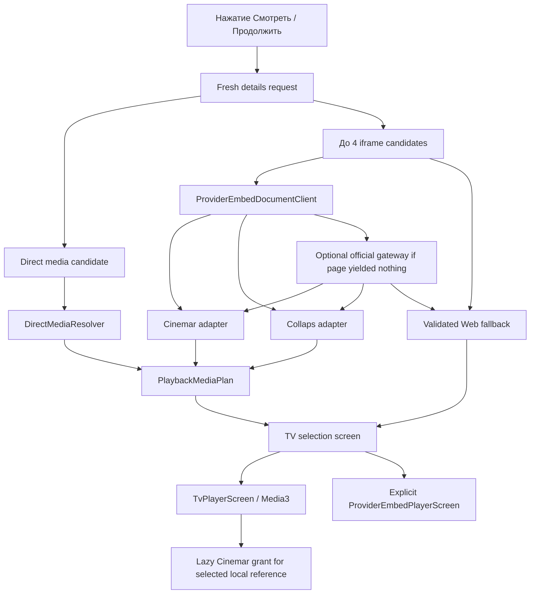

# Архитектура воспроизведения

Последнее обновление: **26 августа 2026 года**.

## Принцип

Нативный Media3-плеер — основной путь. Provider WebView — отдельный явный fallback, а не
оболочка приложения и не скрытая автоматическая подмена.

Playback layer отделён от каталога: каталог сообщает stable content identity и fresh page
candidates, а provider adapter возвращает унифицированный `PlaybackMediaPlan`.

## Production-flow



Перед каждым запуском details и provider documents запрашиваются заново. Page preparation
имеет bounded budget 18 секунд; optional gateway recovery — 12 секунд. Gateway не должен
работать при старте приложения и не должен становиться обязательной catalog dependency.

## Поддерживаемые native inputs

### Direct media

`DirectMediaResolver` принимает явно найденные HTTPS HLS, DASH и MP4 locations, прошедшие
destination validation. Его stable adapter ID всегда равен `direct-media`; HTML provider,
hostname и конечный URL не используются как сохраняемая identity.

### Cinemar

`data/playback/cinemar/`:

- разбирает browser-visible public config;
- поддерживает фильмы и сериалы;
- строит сезоны/серии, озвучки, варианты media и subtitles;
- не выполняет provider JavaScript;
- проверяет все media/subtitle destinations.

Discovery нового Cinemar offer остаётся строгим: только exact HTTPS host `cinemar.cc`,
стандартный порт и непустой `/embed/...` без query/fragment/userinfo. Однако актуальная
authenticated Kinogo detail может уже вернуть player document на непрозрачном exact-host
runtime route. Для этой второй, уже discovered стадии используется отдельный
`validatedPlayerDocumentUri`: разрешён только non-root/non-`/api/` path того же exact host,
по-прежнему без query/fragment/userinfo и нестандартного порта. Это не расширяет discovery
на произвольные Cinemar routes.

Live-контракт от 21 августа 2026 года добавляет deferred leaves: playlist по-прежнему
декодируется из публичного `#2` envelope, но leaf может содержать opaque `data` и пустой
placeholder `file`. Такой leaf попадает в `PlaybackMediaPlan` как случайная локальная ссылка.
Токен и exact iframe остаются в session-owned `CinemarDeferredGrantRegistry`; только когда
Media3 открывает выбранный вариант, registry выполняет один exact-origin JSON-string
`POST /api/playlist/load`, принимает HLS grant и передаёт его безопасному data source.
Grant endpoint не берётся из HTML: он конструируется отдельно на том же origin. Cookies,
redirect и transport retry запрещены; один исход попытки memoize-ится в текущей сессии.

Один registry принадлежит одному media plan и исчезает вместе с playback-сессией. Он
ограничен parser node/document bounds, имеет TTL и single-flight memoization: повторный или
параллельный `open` одной серии не создаёт несколько grant POST. Новый source refresh строит
новый plan/registry и не повторяет старый transient URL.

### Collaps

`data/playback/collaps/`:

- разбирает browser-visible player config;
- поддерживает film, hierarchical seasons и flat episodes;
- отображает audio tracks как voice options;
- поддерживает HLS/DASH/file и subtitles;
- отвергает remote playlist scripts, blocked/DRM-like и unsafe destinations.

### Web fallback

Если native plan построить нельзя, но iframe document прошёл exact-origin/public-DNS
boundary, пользователь может явно открыть provider-only fullscreen WebView.

Web fallback:

- не получает интерфейс сайта Kinogo;
- блокирует navigation за пределы admitted origin;
- запрещает file/content access, mixed content, popup, download, geolocation и permissions;
- отключает third-party cookies;
- сохраняет обычное first-party cookie/DOM-storage состояние только внутри профиля WebView;
- содержит TV HUD и виртуальный D-pad cursor.

При выходе приложение отправляет PlayerJS `pause`, ждёт callback (не более 750 ms), затем
вызывает `CookieManager.flush()` и только после этого уничтожает WebView. Flush сохраняет
лишь внутреннее first-party cookie-состояние профиля WebView: cookies не копируются в
OkHttp/native session и не логируются. `stop` больше не используется, поскольку он сбрасывает
позицию. На
проверенном Cinemar конфиг содержит стабильный `cuid`; штатный механизм PlayerJS может
запоминать playlist item и time в том же browser profile независимо от iframe URL. Это
web-to-web resume, а не экспорт cookies в OkHttp и не межустройственная синхронизация.

На KIVI D-pad selector достиг `Оригинальный web-плеер` (`Смотреть онлайн · cinemar`),
fullscreen WebView запустился и Back чисто вернул Details, затем History. Provider
playlist/position не видны accessibility и безопасным логам; поэтому actual resume после
повторного открытия **не подтверждён** и остаётся отдельным runtime-пунктом.

`PlayerJsCapabilities` и расширенные JS-команды существуют как изолированный код, но полный
унифицированный выбор web-quality/audio/subtitles ещё не подключён к production Web screen.
Не документируйте его как готовый parity с native player.

## Единая медиаматрица

`PlaybackMediaVariant` описывает:

```text
source
season?
episode?
voiceover
quality
media URL
subtitle tracks
optional preferred audio track
```

`PlaybackMediaPlan` гарантирует:

- film и episodic content не смешиваются;
- tuple source/season/episode/voiceover/quality уникален;
- у series есть совместимые season/episode coordinates;
- UI получает только варианты, реально присутствующие в plan;
- optional `PlaybackMediaUrlResolver` живёт только в активном plan, скрывает opaque provider
  token и разрешает локальную ссылку непосредственно на Media3 loader thread.

Список сезонов и серий зависит от выбранной озвучки. UI не строит декартово произведение
несуществующих вариантов.

## Выбор до запуска

После подготовки открывается `PlaybackSourceSelectionScreen`. Он показывает фактический
набор source/voice/season/episode/quality. Сохранённый checkpoint и global preferences
используются как начальный compatible selection.

Карточка details не показывает пустую speculative секцию вариантов. Реальный выбор появляется
только после свежего discovery.

### Контракт качества C-008

Выбранное пользователем качество — долгоживущее намерение, а не подпись фактически
загруженного потока. Fixed choice (`2160p`, `1080p`, `720p`, `480p`) сохраняется как cap
для следующих серий и последующего resume, пока пользователь снова не выберет другое
значение. `Auto` остаётся отдельным намерением. Concrete plan variant и Media3 adaptive
track являются session state и не перезаписывают desired quality в checkpoint.

Для каждой playback unit policy объединяет совместимые fixed variants и конкретные video
tracks, обнаруженные внутри adaptive HLS/DASH manifest. Fixed cap разрешается в таком
порядке:

1. точное совпадение разрешения;
2. максимальное доступное разрешение не выше cap;
3. если все доступные варианты выше cap — минимальное из них как единственный playable
   fallback.

Так, запрос `720p` выбирает `720p`, если он есть; иначе `480p` предпочтительнее `1080p`, но
при единственном наборе `1080p/2160p` выбирается `1080p`. Adaptive и отдельные fixed URL
сравниваются совместно, поэтому наличие Auto/master playlist не маскирует более подходящий
fixed stream. При смене серии та же policy применяется заново к её реальному набору.

MediaItems будущих серий создаются с concrete variant, выбранным по текущему desired quality.
Поэтому изменение intent перестраивает весь будущий episodic playlist до следующего preload или
перехода, даже если concrete variant текущей серии уже совпадает. Перестройка сохраняет exact
current variant/reference, media-item index, position и play state, сбрасывает stale preload/error
и async generations; одноразовый Cinemar grant текущей серии повторно не выполняется.

## Native player

Основные файлы:

- `player/ui/TvPlayerScreen.kt`;
- `player/PlaybackCompletionPolicy.kt`;
- `player/PlayerContract.kt`;
- `player/TvPlayerReducer.kt`;
- `player/TvPlayerKeyMapper.kt`;
- `player/Media3PlayerController.kt`;
- `player/SafePlaybackDataSources.kt`.

Media3 `PlayerView` выводит видео без стандартного controller. Весь интерактивный HUD
рисует Compose:

- title/status;
- elapsed/duration и focusable timeline;
- previous/play-pause/next;
- season, voiceover, quality и subtitles selectors;
- нижняя episode row для series.

HUD полупрозрачный и полноэкранное видео остаётся видимым.
Выбор provider source и native/Web route происходит в `PlaybackSourceSelectionScreen`
до создания playback session. Native HUD не дублирует кнопки `Источник` и
`Web-плеер`; для их смены после запуска нужно вернуться в Details и снова открыть
действие `Смотреть`/`Продолжить`.

Отдельной кнопки «Обновить источник» в native HUD нет. Ошибка или обнаруженный stall
сначала запускают bounded automatic recovery; после исчерпания попытки Back возвращает в
карточку, где действие «Смотреть» выполняет новый полный discovery. Это не относится к
изолированному Web fallback, чей provider-specific flow остаётся отдельным.

### Buffer target и LoadControl C-008

Настройка «Буфер воспроизведения» хранит `T ∈ {5, 10, 15, 20, 30}` секунд; default —
15 секунд. Это не декоративная подпись: `PlaybackBufferPolicy` строит реальный Media3
`DefaultLoadControl` со следующими значениями:

```text
targetMs = T * 1000
minBufferMs = targetMs
maxBufferMs = targetMs
bufferForPlaybackMs = (targetMs / 3).coerceIn(1000, 2500)
bufferForPlaybackAfterRebufferMs = (targetMs / 2).coerceIn(2000, 5000)
nextEpisodePreloadMs = (targetMs / 2).coerceIn(2000, 5000)
targetPreloadDurationUs = nextEpisodePreloadMs * 1000
prioritizeTimeOverSizeThresholds = true
```

Preference сохраняется в DataStore и входит в `remember` identity `TvPlayerScreen`.
Изменение target поэтому пересоздаёт Media3/ExoPlayer с новым LoadControl; уже созданный
instance не продолжает работать со старой конфигурацией.

Сфокусированный timeline не получает прямоугольную рамку. Его текущая позиция обозначается
белой точкой диаметром 12 dp. При Media3 `STATE_BUFFERING` по центру видео появляется
индикатор в затемнённом круге; в `reduceMotion` вместо анимации остаётся статическое кольцо.

## Контракт пульта

| Состояние | Кнопка | Действие |
| --- | --- | --- |
| HUD скрыт | `OK` | Показать HUD; не ставить на паузу первым нажатием |
| HUD скрыт | `Left` / `Right` | Seek на настроенный шаг, показать HUD и сфокусировать timeline |
| HUD скрыт | `Up` / `Down` | Показать HUD |
| HUD открыт | D-pad | Обычная focus navigation; seek только когда focus на timeline |
| Любое | Play/Pause/Stop | Прямое media-действие |
| Любое | Media Previous/Next | Предыдущая/следующая доступная серия, включая границу сезона |
| Любое | Rewind/Fast Forward | Seek на настроенный шаг |
| Series | `0`–`9` | Набрать номер серии; timeout 1,5 секунды или подтверждение `OK` |
| Drawer открыт | `Back` | Закрыть drawer и вернуть focus вызвавшему selector |
| HUD открыт | `Back` | Скрыть HUD |
| HUD скрыт | `Back` | Сохранить checkpoint и вернуться в карточку |

Повторный seek не должен теряться в момент появления HUD. `HudFocusRequest` повторяет
timeline focus на следующих Compose frames, если первый `requestFocus()` вернул `false`.

Previous/Next не вычисляют номер простой арифметикой. `PlaybackMediaPlan` строит
упорядоченный список существующих координат для текущих source и voiceover. Поэтому переход
с последней серии сезона выбирает первую реально доступную серию следующего совместимого
сезона, а переход назад с первой серии — последнюю доступную серию предыдущего. Пропуски в
номерах сезонов и серий не синтезируются.

## История и resume

Источник истины — `WatchProgress`, не Media3 URL.

Начиная с C-009 сохраняемая `PlaybackSelection` также содержит optional stable
`sourceId` адаптера (`cinemar`, `collaps`, `direct-media` и аналогичные безопасные
идентификаторы). Это не URL и не token. Codec v3 пишет `sourceId`; записи v1/v2 читаются
с `sourceId=null` и при следующей записи мигрируют без потери season/episode/voice/quality/
position. `PlaybackProgressKey` по-прежнему состоит только из content/season/episode:
смена источника обновляет ту же playback unit, а не создаёт параллельную историю.

Checkpoint сохраняется:

- каждые 10 секунд;
- при pause/lifecycle boundary;
- перед сменой variant/source/episode;
- при error/end/exit.

Resume начинает на 5 секунд раньше сохранённой позиции. Eligibility и completion определяет
`WatchProgressRules`: учитывается минимальная просмотренная длительность, 90% и остаток до
конца. История группируется по content ID, но хранит записи отдельных эпизодов. Исходная
сохранённая unit остаётся эталоном для pre-play selector: если свежий source plan нормализует
её в другой сезон/эпизод, старая позиция не применяется. После ручного возврата к той же unit
в selector продолжение снова доступно.

`PlaybackCheckpoint` несёт explicit `playbackEnded`: completion не выводится только из
последней позиции Media3. При переходе на другую серию сначала записывается завершение
предыдущей, затем новая активная S/E немедленно получает checkpoint с position 0. Благодаря
этому выход до первого progress tick всё равно возвращает к выбранной серии, а не к первой
или ранее просмотренной.

Root принимает callback только от текущей `ActivePlaybackSession.generation`. UI snapshot
обновляется синхронно, durable DataStore writes последовательно проходят через
`PlaybackCheckpointWriteQueue`, а timestamp растёт монотонно относительно memory и store.
`PlaybackProgressCollection.upsert` не позволяет поздней записи с меньшим timestamp затереть
новую. Перед вычислением resume root ждёт очередь и нормализует объединение памяти с
DataStore, поэтому закрытие плеера и немедленное повторное «Продолжить» видят один порядок.

Home, Catalog, Search, History, Bookmarks и возврат из player используют одну
`preferredResumeProgress` policy. Для content ID
сначала выбирается newest активная единица: eligible progress, explicit completed checkpoint
или episodic checkpoint с position 0. Только после этого проверяется completion. Если newest
единица завершена, Continue action отсутствует и policy не откатывается к более старой
незавершённой серии. Details показывает season/episode/position, например
`Продолжить S03E07 с 17:42`; для новой серии с position 0 — `Продолжить S03E07` без
фиктивного времени.

Точная позиция локальна для TV и не синхронизируется с аккаунтом сайта. Серверный
контракт Kinogo в приложении охватывает только status/favorite закладок; provider
WebView `localStorage` — локальное web-to-web state, а не account sync.

Обычный `OK` в Истории открывает Details; он больше не вызывает resume напрямую.
Экран показывает одну карточку на content ID, поэтому пользовательское удаление материала
атомарно удаляет все его movie/episode checkpoints. Удаление и полная очистка сериализованы
той же очередью, что checkpoint writes; после операции root заменяет память точным снимком
store, не объединяя его с уже удалёнными записями. `clear()` удаляет только ключ playback
history и сохраняет остальные Preferences DataStore.

## Auto-next

Настройка `autoNextEpisode` применяется к Media3 session. Завершение элемента плейлиста
обрабатывается по трём фактическим сигналам Media3:

- `PlaybackMediaPlan.episodeCoordinatesFor` заранее разворачивает все реально доступные
  серии совместимых сезонов текущих source/voiceover в один Media3 playlist;
- автоматический `onMediaItemTransition`, в том числе на границе сезона, сначала сохраняет
  финальный checkpoint старой серии, затем записывает активацию новой серии с position 0 и
  продолжает её;
- при отключённом auto-next `pauseAtEndOfMediaItems` выдаёт
  `PLAY_WHEN_READY_CHANGE_REASON_END_OF_MEDIA_ITEM`: серия получает финальный checkpoint,
  а fullscreen flow сразу возвращается в карточку;
- `STATE_ENDED` фильма или последней coordinate общего playlist передаётся
  `PlaybackCompletionPolicy` и возвращает в карточку.

C-008 заменяет прежнюю ручную подстановку первой серии следующего сезона единым playlist.
При `autoNextEpisode=true` сезонная граница больше не требует replacement Media3 session;
при `false` end-of-item signal по-прежнему сохраняет completion checkpoint и возвращает в
Details. Новый runtime-flow ещё нужно подтвердить на TV.

Тот же cross-season порядок используется ручными Previous/Next. Сейчас отдельного
визуального обратного отсчёта следующей серии нет; countdown с Cancel/Play now остаётся в
roadmap.

### Bounded prefetch следующей серии

Плеер предзагружает только непосредственную следующую реальную coordinate для текущих
source/voiceover; номера не синтезируются и fan-out по playlist запрещён. Все совместимые
сезоны уже развёрнуты в один список, поэтому та же штатная Media3 preloading-модель без
особой ветки покрывает границу сезона.

`ExoPlayer.PreloadConfiguration` получает
`targetPreloadDurationUs = PlaybackBufferConfiguration.nextEpisodePreloadMs * 1000`, где
`nextEpisodePreloadMs = (T * 1000 / 2).coerceIn(2000, 5000)`: 2,5 с при `T=5`, 5 с при
`T=10/15/20/30`. Gate разрешает этот open только для сериала с включённым auto-next,
`playWhenReady=true` и без suppression, когда до конца текущей серии осталось не больше `T`,
а её buffered position достигла как минимум `duration - 500 ms`. Pause, suppression,
close/transition и seek назад disarm-ят preload; после seek назад он не rearm-ится до
возврата к прежней позиции.

Media3 держит только следующий playlist item в памяти и открывает его через тот же
session-owned resolver/data-source factory. Для Cinemar это означает обычное ленивое
разрешение current leaf и только оппортунистическое разрешение immediate-next leaf после
прохождения gate. Отдельного resolver warmup и disk cache нет. Grant/token, iframe и
конечный media URL не попадают в checkpoint, DataStore, `MediaItem` URI или логи.

Нефатальный load error будущей immediate-next window лишь отключает preload и не запускает
recovery текущей серии. Terminal error будущей window сохраняется как exact
playlist-generation/index/variant identity; fresh recovery запускается только после того,
как эта exact window стала текущей. Stale generation, другая или более дальняя future item
игнорируются.

## Автоматическое восстановление error/stall

Recovery запускается как по `Player.Listener.onPlayerError`, так и по сигналу чистого
`PlaybackStallWatchdog`. Watchdog наблюдает wall-clock и позицию, пока плеер действительно
намерен воспроизводить:

- начальная `BUFFERING` без прогресса — `max(20, T)` секунд;
- повторная `BUFFERING` после уже замеченного прогресса —
  `T.coerceIn(5, 10)` секунд;
- `READY` с `playWhenReady=true`, но без движения позиции — 15 секунд.

Здесь `T` — выбранный buffer target. Например, target 5 секунд даёт initial/rebuffer
timeouts 20/5 секунд, а target 30 — 30/10 секунд. Явная source/load error во время
`BUFFERING` проходит через `onPlayerError` сразу и не ждёт watchdog timeout.

Pause, `playWhenReady=false`, playback suppression, `IDLE` и `ENDED` исключены. Само по себе
приближение позиции к известному duration не означает natural end: near-end `READY`/`BUFFERING`
без продвижения проходит через обычный recovery timeout, иначе потерянный последний сегмент
навсегда блокировал бы auto-next. Движение минимум на 250 ms сбрасывает окно отсутствия
прогресса. Один экземпляр watchdog выдаёт recovery-сигнал только один раз и сбрасывается лишь
при осознанной смене source/voice/season/episode.

Перед recovery плеер сохраняет explicit checkpoint и запрашивает у composition root свежую
details/provider preparation. Это не retry старого URL: новый `PlaybackMediaPlan` строится
обычным защищённым discovery-flow, после чего выбор нормализуется по свежей sparse-матрице.
Root увеличивает `playbackSessionGeneration`; generation входит в key player host, поэтому
даже структурно равный plan создаёт новый Media3/ExoPlayer и не переиспользует зависшую
сессию. Позиция и automatic restart восстанавливаются только если normalized selection
сохранил exact исходные `contentId/season/episode`. Если unit изменилась либо исчезла, flow
открывает обычный selector с позицией 0 и не запускает другую серию незаметно.

Автоматический refresh ограничен одной попыткой на stable unit key
`contentId + season? + episode?`. Набор attempted keys переносится в replacement player session,
поэтому тот же failing provider не может создать inter-screen loop. Смена remapped source/quality
не обнуляет лимит; другая серия получает свою одну попытку. После исчерпания лимита
остаётся user-safe error с действиями Back/выход в Details. Ручной native refresh из HUD
удалён: новый discovery пользователь может явно запустить кнопкой «Смотреть» в карточке.
URL и attempted provider data не сохраняются.

Consumed attempted-unit budget объединяется с active session **до** открытия launch screen
и disposal failing Media3. Recovery launch устанавливает discard-on-exit contract. Если до
подготовки пользователь нажал Back, material исчез из известных карточек либо active
verified mirror отсутствует, root очищает active/pending/embed sessions, увеличивает launch
generation и показывает конкретную ошибку. Back из ошибки возвращает в Details; late job не
может resurrect-ить dead player с пустым immutable attempt set.

Три pure safety guards проверяют: persistence budget + discard, неизменность ordinary launch
и explicit early errors для missing content/mirror. Отдельный exact-unit guard проверяет,
что old position не применяется к другому episode.

Исторический focused C-007 runtime на KIVI Android TV 14 подтвердил current exact-host Cinemar route:
native selector «Далеко во Вселенной» показал озвучки, сезоны 1–4 и серии, resume — 10:48;
Media3 S2E5 продвинулся 11:01 → 11:39. Скрытый HUD по `OK` открылся без паузы. Back вернул
Player → Details → History. Отдельно подтверждены возврат/focus второй History card и
второго Search result с сохранённым запросом/выдачей. Actual expired/404 source, exact
same-unit automatic recovery и natural cross-season end остаются отдельными pending сценариями.

C-008 добавляет configurable real LoadControl, связанный с ним watchdog, новую Media3
generation, bounded next-coordinate prefetch, serialised checkpoint writes и общую
adaptive+fixed quality policy. Application source `4cfa7ac8ebd48b70c7b172e54a0716fec09669a1`
прошёл local canonical 87 suites / 441 tests без failures/errors/skips и lint без errors, но
не наследует для этих ветвей аппаратное evidence C-007. Проверка stall/error recovery,
фактического buffer target, cross-season warmup, немедленного resume,
перехода сезонов и смены quality на реальном TV остаётся **PENDING**. Подключение по ADB,
установка APK и аппаратный smoke
допустимы только после отдельного явного разрешения владельца на конкретный необходимый
сценарий; до этого результат формулируется только по review и автоматическим тестам.

C-009 добавляет Details-first History с content-level delete/clear, codec v3 `sourceId` и
видимый startup update prompt/retry/no-cache, не меняя bounded playback recovery. Exact
source `777c8a0528f24db67402536631257d6cdc91f148` прошёл canonical
`89 suites / 455 tests` за `7m12s`, post-commit release rerun — за `4m04s`. Локальный
stable-signed `KinogoATV-0.5.3-code17.apk` (`38,386,398` bytes, SHA-256
`3C88DF356A9815865DB02F7821DA53BE3C6E25F03FE493516FCCAF0F48F0C17A`) содержит exact
embedded revision. App/docs merge `0473a820eefedea16ce2f393df568c90e5b30bbe`, PR/main CI
`32920452170`/`32920746857`, annotated `v0.5.3` и regular latest Release с exact asset —
**PASS**. Manifest source `7faebbba8d305a0c339f6966e7759ec7c7f96b90` merged как
`ff7f5f8eea9776ef626010fe57993dc1906f5d4a`; manifest/CI/Pages/live transports также
**PASS**. Все transports зависят от GitHub assets. Hardware runtime, включая restart-resume
с non-default source, long-OK History, in-app updater и install, остаётся **PENDING**;
release tag не является playback baseline.

C-010 не меняет resolver/watchdog/quality алгоритмы. Он удаляет source/Web controls из
native HUD, оставляя их в pre-launch selector, и применяет один local resume contract
к Home/Catalog/Search/History/Bookmarks/player return. Exact source
`b6b2d379dad90bd33ba35725cc9d329166d365e8` прошёл 91 suites / 462 tests за
4m58s; post-commit release rerun — 3m38s. Exact APK `KinogoATV-0.5.4-code18.apk` имеет
38 402 782 bytes, SHA-256 `541941C081136854D17FB7258E92149D98F1292A56DAD02724BC1DCAA9F543AC`
и embedded exact source revision. Реальный player/resume runtime без ADB не повторялся и
остаётся **PENDING**.

## Сетевые ограничения плеера

- Только HTTPS и public DNS destinations.
- Media3 redirect выполняется вручную, максимум пять переходов.
- При смене origin чувствительные headers удаляются.
- Private/local/documentation networks запрещены.
- Embed, media и subtitle URL не сохраняются и скрываются в `toString`.
- Cinemar discovery принимает только `/embed/...`; already discovered runtime player document
  проходит отдельную exact-host/non-root/non-`/api/` проверку без query/fragment/userinfo/
  non-443 port.
- Cinemar grant token не включается в MediaItem URI, storage, cookie jar или diagnostics;
  fixed same-origin grant endpoint не получает cookies, не следует redirect, не повторяет
  transport request и имеет bounded response.
- Истёкший 401/403/404/410 URL требует fresh preparation, а не бесконечного retry того же
  location.
- DRM, remote JavaScript playlist и неизвестный config нельзя обходить.

## Добавление адаптера

Acceptance checklist:

1. Отдельный package models/parser/adapter.
2. Минимальные redacted fixtures для film и series.
3. Malformed, oversized, unsafe, blocked и missing-config tests.
4. Public-DNS validation каждого конечного URL.
5. Mapping в `PlaybackMediaPlan` и проверка уникальности координат.
6. Dependent choice tests.
7. Подключение только в `KinogoPlaybackPreparationService`.
8. Сохранение явного web fallback.
9. Unit/lint/build.
10. Реальный TV-тест start/resume/seek/source/episode/media keys.

Дополнительная целевая спецификация: [`NATIVE_PLAYER_TV_UX.md`](NATIVE_PLAYER_TV_UX.md).
Границы provider adapters: [`NATIVE_PROVIDER_ADAPTERS.md`](NATIVE_PROVIDER_ADAPTERS.md).
