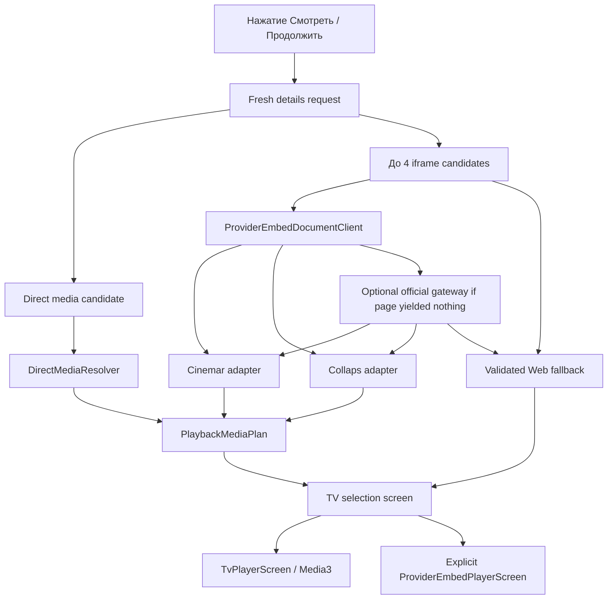

# Архитектура воспроизведения

Последнее обновление: **15 августа 2026 года**.

## Принцип

Нативный Media3-плеер — основной путь. Provider WebView — отдельный явный fallback, а не
оболочка приложения и не скрытая автоматическая подмена.

Playback layer отделён от каталога: каталог сообщает stable content identity и fresh page
candidates, а provider adapter возвращает унифицированный `PlaybackMediaPlan`.

## Production-flow



Перед каждым запуском details и provider documents запрашиваются заново. Page preparation
имеет bounded budget 18 секунд; optional gateway recovery — 12 секунд. Gateway не должен
работать при старте приложения и не должен становиться обязательной catalog dependency.

## Поддерживаемые native inputs

### Direct media

`DirectMediaResolver` принимает явно найденные HTTPS HLS, DASH и MP4 locations, прошедшие
destination validation.

### Cinemar

`data/playback/cinemar/`:

- разбирает browser-visible public config;
- поддерживает фильмы и сериалы;
- строит сезоны/серии, озвучки, варианты media и subtitles;
- не выполняет provider JavaScript;
- проверяет все media/subtitle destinations.

### Collaps

`data/playback/collaps/`:

- разбирает browser-visible player config;
- поддерживает film, hierarchical seasons и flat episodes;
- отображает audio tracks как voice options;
- поддерживает HLS/DASH/file и subtitles;
- отвергает remote playlist scripts, blocked/DRM-like и unsafe destinations.

### Web fallback

Если native plan построить нельзя, но iframe document прошёл exact-origin/public-DNS
boundary, пользователь может явно открыть provider-only fullscreen WebView.

Web fallback:

- не получает интерфейс сайта Kinogo;
- блокирует navigation за пределы admitted origin;
- запрещает file/content access, mixed content, popup, download, geolocation и permissions;
- отключает third-party cookies;
- содержит TV HUD и виртуальный D-pad cursor.

`PlayerJsCapabilities` и расширенные JS-команды существуют как изолированный код, но полный
унифицированный выбор web-quality/audio/subtitles ещё не подключён к production Web screen.
Не документируйте его как готовый parity с native player.

## Единая медиаматрица

`PlaybackMediaVariant` описывает:

```text
source
season?
episode?
voiceover
quality
media URL
subtitle tracks
optional preferred audio track
```

`PlaybackMediaPlan` гарантирует:

- film и episodic content не смешиваются;
- tuple source/season/episode/voiceover/quality уникален;
- у series есть совместимые season/episode coordinates;
- UI получает только варианты, реально присутствующие в plan.

Список сезонов и серий зависит от выбранной озвучки. UI не строит декартово произведение
несуществующих вариантов.

## Выбор до запуска

После подготовки открывается `PlaybackSourceSelectionScreen`. Он показывает фактический
набор source/voice/season/episode/quality. Сохранённый checkpoint и global preferences
используются как начальный compatible selection.

Карточка details не показывает пустую speculative секцию вариантов. Реальный выбор появляется
только после свежего discovery.

## Native player

Основные файлы:

- `player/ui/TvPlayerScreen.kt`;
- `player/PlaybackCompletionPolicy.kt`;
- `player/PlayerContract.kt`;
- `player/TvPlayerReducer.kt`;
- `player/TvPlayerKeyMapper.kt`;
- `player/Media3PlayerController.kt`;
- `player/SafePlaybackDataSources.kt`.

Media3 `PlayerView` выводит видео без стандартного controller. Весь интерактивный HUD
рисует Compose:

- title/status;
- elapsed/duration и focusable timeline;
- previous/play-pause/next;
- source, season, voiceover, quality и subtitles selectors;
- нижняя episode row для series.

HUD полупрозрачный и полноэкранное видео остаётся видимым.

Сфокусированный timeline не получает прямоугольную рамку. Его текущая позиция обозначается
белой точкой диаметром 12 dp. При Media3 `STATE_BUFFERING` по центру видео появляется
индикатор в затемнённом круге; в `reduceMotion` вместо анимации остаётся статическое кольцо.

## Контракт пульта

| Состояние | Кнопка | Действие |
| --- | --- | --- |
| HUD скрыт | `OK` | Показать HUD; не ставить на паузу первым нажатием |
| HUD скрыт | `Left` / `Right` | Seek на настроенный шаг, показать HUD и сфокусировать timeline |
| HUD скрыт | `Up` / `Down` | Показать HUD |
| HUD открыт | D-pad | Обычная focus navigation; seek только когда focus на timeline |
| Любое | Play/Pause/Stop | Прямое media-действие |
| Любое | Media Previous/Next | Предыдущая/следующая доступная серия, включая границу сезона |
| Любое | Rewind/Fast Forward | Seek на настроенный шаг |
| Series | `0`–`9` | Набрать номер серии; timeout 1,5 секунды или подтверждение `OK` |
| Drawer открыт | `Back` | Закрыть drawer и вернуть focus вызвавшему selector |
| HUD открыт | `Back` | Скрыть HUD |
| HUD скрыт | `Back` | Сохранить checkpoint и вернуться в карточку |

Повторный seek не должен теряться в момент появления HUD. `HudFocusRequest` повторяет
timeline focus на следующих Compose frames, если первый `requestFocus()` вернул `false`.

Previous/Next не вычисляют номер простой арифметикой. `PlaybackMediaPlan` строит
упорядоченный список существующих координат для текущих source и voiceover. Поэтому переход
с последней серии сезона выбирает первую реально доступную серию следующего совместимого
сезона, а переход назад с первой серии — последнюю доступную серию предыдущего. Пропуски в
номерах сезонов и серий не синтезируются.

## История и resume

Источник истины — `WatchProgress`, не Media3 URL.

Checkpoint сохраняется:

- каждые 10 секунд;
- при pause/lifecycle boundary;
- перед сменой variant/source/episode;
- при error/end/exit.

Resume начинает на 5 секунд раньше сохранённой позиции. Eligibility и completion определяет
`WatchProgressRules`: учитывается минимальная просмотренная длительность, 90% и остаток до
конца. История группируется по content ID, но хранит записи отдельных эпизодов.

History, Catalog и Search используют одну `preferredResumeProgress` policy: среди записей
того же content ID выбирается самая новая незавершённая единица с eligible resume position.
Завершённый checkpoint первой серии не маскирует более новую незавершённую серию.
Details показывает season/episode/position в действии, например
`Продолжить S03E07 с 17:42`; если все checkpoints завершены, Continue action не показывается.

Точная позиция локальна для TV и не синхронизируется с аккаунтом сайта.

## Auto-next

Настройка `autoNextEpisode` применяется к Media3 session. Завершение элемента плейлиста
обрабатывается по трём фактическим сигналам Media3:

- автоматический `onMediaItemTransition` внутри сезона сначала сохраняет финальный checkpoint
  старой серии, затем продолжает следующую;
- при отключённом auto-next `pauseAtEndOfMediaItems` выдаёт
  `PLAY_WHEN_READY_CHANGE_REASON_END_OF_MEDIA_ITEM`: серия получает финальный checkpoint,
  а fullscreen flow сразу возвращается в карточку;
- `STATE_ENDED` фильма или последнего элемента сезонного playlist передаётся
  `PlaybackCompletionPolicy`: он либо запускает первую реально доступную координату
  следующего совместимого сезона для текущих source/voiceover, либо возвращает в карточку.

В `0.5.0` end-of-item pause не трактуется как exit, если `autoNextEpisode=true`: flow ждёт
решения cross-season completion policy. Замена media items на первую серию следующего сезона
явно возобновляет playback, даже если завершившийся item уже сбросил `playWhenReady`.
При отключённом auto-next тот же сигнал по-прежнему сохраняет completion checkpoint и возвращает в
details. Оба варианта покрыты unit policy, но новый runtime-flow ещё нужно подтвердить на TV.

Тот же cross-season порядок используется ручными Previous/Next. Сейчас отдельного
визуального обратного отсчёта следующей серии нет; countdown с Cancel/Play now остаётся в
roadmap.

## Обновление источника при playback error

При Media3 playback error плеер сначала сохраняет checkpoint, затем может один раз
запросить у composition root свежую details/provider preparation. Это не retry старого URL:
новый `PlaybackMediaPlan` строится обычным защищённым discovery-flow, после чего выбор
нормализуется по свежей sparse-матрице. Позиция и automatic restart восстанавливаются только
если normalized selection сохранил exact исходные `contentId/season/episode`. Если unit
изменилась либо исчезла, flow открывает обычный selector с позицией 0 и не запускает другую
серию незаметно.

Автоматический refresh ограничен одной попыткой на stable unit key
`contentId + season? + episode?`. Набор attempted keys переносится в replacement player session,
поэтому тот же failing provider не может создать inter-screen loop. Смена remapped source/quality
не обнуляет лимит; другая серия получает свою одну попытку. После исчерпания лимита
остаётся обычный user-safe error и ручное действие refresh. URL и attempted provider data не сохраняются.
Этот recovery покрыт pure tests; реальный expiry/error на TV для `0.5.0` pending.

Consumed attempted-unit budget объединяется с active session **до** открытия launch screen
и disposal failing Media3. Recovery launch устанавливает discard-on-exit contract. Если до
подготовки пользователь нажал Back, material исчез из известных карточек либо active
verified mirror отсутствует, root очищает active/pending/embed sessions, увеличивает launch
generation и показывает конкретную ошибку. Back из ошибки возвращает в Details; late job не
может resurrect-ить dead player с пустым immutable attempt set.

Три pure safety guards проверяют: persistence budget + discard, неизменность ordinary launch
и explicit early errors для missing content/mirror. Отдельный exact-unit guard проверяет,
что old position не применяется к другому episode.

Basic C-006 runtime на KIVI подтвердил не error-recovery, а checkpoint/return contract:
после ~14 секунд native playback Back вернул Details с focused
`Продолжить с 0:14`. Actual expired/404 source, exact same-unit automatic recovery и natural
cross-season end остаются отдельными pending сценариями.

## Сетевые ограничения плеера

- Только HTTPS и public DNS destinations.
- Media3 redirect выполняется вручную, максимум пять переходов.
- При смене origin чувствительные headers удаляются.
- Private/local/documentation networks запрещены.
- Embed, media и subtitle URL не сохраняются и скрываются в `toString`.
- Истёкший 401/403/404/410 URL требует fresh preparation, а не бесконечного retry того же
  location.
- DRM, remote JavaScript playlist и неизвестный config нельзя обходить.

## Добавление адаптера

Acceptance checklist:

1. Отдельный package models/parser/adapter.
2. Минимальные redacted fixtures для film и series.
3. Malformed, oversized, unsafe, blocked и missing-config tests.
4. Public-DNS validation каждого конечного URL.
5. Mapping в `PlaybackMediaPlan` и проверка уникальности координат.
6. Dependent choice tests.
7. Подключение только в `KinogoPlaybackPreparationService`.
8. Сохранение явного web fallback.
9. Unit/lint/build.
10. Реальный TV-тест start/resume/seek/source/episode/media keys.

Дополнительная целевая спецификация: [`NATIVE_PLAYER_TV_UX.md`](NATIVE_PLAYER_TV_UX.md).
Границы provider adapters: [`NATIVE_PROVIDER_ADAPTERS.md`](NATIVE_PROVIDER_ADAPTERS.md).
