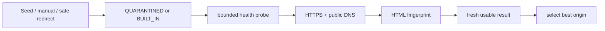

# Интеграция с Kinogo

Последнее обновление: **1 августа 2026 года**.

## Граница интеграции

Документированного публичного API сайта для всех нужных функций нет. Production-каталог,
авторизация и серверные закладки работают как обычный браузерный клиент:

- ограниченные HTTPS GET/POST;
- origin-scoped cookies;
- разбор server-rendered HTML и DLE responses;
- повторная авторизация на новом проверенном origin.

Закрытый JSON-шлюз официального Android-приложения не является основным backend приложения.
Он используется только как необязательный recovery path во время подготовки плеера.
Подробности снимка — в [`OFFICIAL_APP_RESEARCH.md`](OFFICIAL_APP_RESEARCH.md).

Сетевой протокол изменчив. Даты исследовательских наблюдений не означают, что endpoint
гарантирован сегодня; контрактные fixtures и live-проверка нужны после любого сбоя.

## Replaceable origins

Встроенные кандидаты в текущем коде:

```text
https://kinogo.parts
https://kinogo.online
```

Это bootstrap candidates, а не криптографическое доказательство «официальности». Их
доступность и service fingerprint проверяются во время работы.

`MirrorUrlNormalizer` принимает только origin:

- схема только `https`;
- без path, query, fragment и user info;
- порт только стандартный 443;
- без IP literals, localhost и reserved/local DNS suffixes;
- IDN нормализуется в ASCII.

## Жизненный цикл зеркала



- Manual и discovery candidates не trusted до успешной проверки.
- Redirecting origin не наследует доверие конечного origin.
- Безопасная конечная цель redirect добавляется как отдельный candidate и проходит отдельный
  probe.
- Health TTL — 6 часов.
- Refresh ограничивает количество и параллельность probes.
- Challenge/CAPTCHA, 401/403, geo restriction или DRM не являются поводом обходить защиту или
  бесконечно перебирать домены.

Сейчас discovery получает новые кандидаты только из ручного ввода и безопасных redirect
targets. Интернет-wide crawler и подписанный remote manifest ещё не подключены.

Ключевые файлы:

- `data/mirror/MirrorRegistry.kt`;
- `data/mirror/MirrorHealthChecker.kt`;
- `data/mirror/MirrorPreferencesStore.kt`;
- `data/network/ResilientPublicDns.kt`.

## HTTP-клиенты

`SafeHtmlClient` и `KinogoSessionHttpClient` выполняют:

- HTTPS/public-DNS destination validation;
- ограничение redirect;
- ограничение размера документа;
- проверку content type и service fingerprint;
- нормализацию terminal same-origin relative path;
- redaction чувствительных данных в диагностике.

Cookie jar разделён по origin. Cookies и password POST нельзя переносить через cross-origin
redirect. При смене зеркала `KinogoSessionManager` входит на новом origin сохранёнными
credentials.

## Каталог, фильтры и поиск

### Live snapshot 2026-08-01

На момент проверки оба bootstrap origin, `https://kinogo.parts` и
`https://kinogo.online`, перенаправляли на `https://w.kinogo.solar/`. Это датированное
наблюдение, а не постоянный адрес и не доказательство официальности домена. Raw filter block
на трёх адресах совпадал; приложение по-прежнему использует выбранный проверенный origin и
не сохраняет конечный host в карточках.

Текущий DLE-шаблон использует stateful xSort, а не отдельные GET-маршруты года, страны и
жанра. Корневые маршруты задают только ленту:

| Назначение | Относительный путь |
| --- | --- |
| Главная | `/` |
| Категория | один из allowlisted путей ниже |
| Поиск | `/search/{percent-encoded term}/` |
| Страница главной | `/page/{n}/` |
| Страница категории | `{category-base}page/{n}/`, например `/filmy/page/2/` |
| Страница поиска | `/search/{percent-encoded term}/page/{n}/` |

`KinogoHtmlParser` определяет наличие следующей страницы по `.pagiNation a[href]` и номеру
`/page/{n}/` либо ссылке `Позже`. `KinogoRoutes` затем строит page-route для той же базовой
ленты. Один paging generation закреплён за origin и query identity; карточки добавляются по
стабильному ID без повторов. Search является отдельным режимом и не комбинируется с
категорией или browse filters.

Клиентская политика загрузки поверх этого wire contract:

- `TvPosterGrid` просит следующую страницу, когда под строкой сфокусированной карточки
  остаётся меньше двух загруженных строк; один и тот же query-aware boundary запрашивается
  только один раз;
- Home после первой страницы автоматически следует только по строго возрастающему
  `nextPage`, пока не накопит минимум 18 уникальных карточек (`3 × 6`) либо пока сервер не
  завершит выдачу; повторы ID не засчитываются в этот резерв;
- после готовности Home-reserve приложение в фоне загружает первую страницу Catalog с
  прежним default `CatalogCategory.NEW_RELEASES` и маршрутом `/novinki/`;
- прямой вход пользователя в Catalog немедленно планирует эту загрузку и не зависит от
  готовности Home-reserve. Категории, их allowlist и маршруты этим правилом не меняются.

### Категории

Когда ответ содержит sidebar, категории читаются из `aside#sideBar .categories` и
`.bySearials`/`.bySerials`, но href принимается только при совпадении same-origin relative
path с `CatalogCategory`. xSort POST может вернуть полноценный документ либо fragment без
sidebar: непустой разобранный subset сохраняется как есть, а только при пустом списке UI
использует ровно 28 проверенных `CatalogCategory.entries`. Произвольный href не становится
fallback-пунктом. Числа рядом с категориями изменчивы и в модель не входят.

Фильмы, в порядке текущего сайта:

| Название | Путь | Название | Путь |
| --- | --- | --- | --- |
| Все фильмы | `/filmy/` | Мультфильмы | `/multfilmy/` |
| Новинки | `/novinki/` | Фантастика | `/fantastika/` |
| Фэнтези | `/fjentezi/` | Нуар | `/nuar/` |
| Ужасы | `/uzhasy/` | Триллер | `/triller/` |
| Спорт | `/sport/` | Приключения | `/prikljuchenija/` |
| Исторические | `/istoricheskie/` | Мюзикл | `/mjuzikl/` |
| Мелодрама | `/melodrama/` | Короткометражка | `/korotkometrazhka/` |
| Криминал | `/kriminal/` | Драма | `/drama/` |
| Комедия | `/komedija/` | Документальные | `/dokumentalnye/` |
| Детектив | `/detektiv/` | Детский | `/detskij/` |
| Военный | `/voennyj/` | Вестерн | `/vestern/` |

Сериалы:

| Название | Путь | Название | Путь |
| --- | --- | --- | --- |
| Все сериалы | `/serialy/` | Зарубежные | `/zarubezhnye-serialy/` |
| Русские | `/russkie-serialy/` | Мультсериалы | `/multserialy/` |
| Аниме-сериалы | `/anime-serialy/` | Аниме | `/anime/` |

### xSort contract

Контейнер управления — `.xsort-area`; каждый список имеет вид
`.xsort-ul[data-field] > li[data-val]`, активный пункт отмечен `li.current`, отображаемое
значение находится в `.xsort-selected`, сброс — в `.xsort-div-clearall`, а карточки ответа —
в `#dle-content`.

Поддерживаются ровно четыре server fields:

| Поле | Назначение | Источник вариантов |
| --- | --- | --- |
| `defaultsort` | серверная сортировка | allowlisted wire values из HTML |
| `podborki` | подборка | динамически из HTML |
| `year` | год | динамически из HTML |
| `country` | страна | динамически из HTML |

Wire values сортировки: `date`, `rating`, `views_top`, `views`, `comm`, `year`, `kp`. На
главной в snapshot отсутствовал пустой вариант, текущим был `views_top` с направлением
DESC. На `/filmy/` и `/serialy/` перед теми же семью вариантами присутствовал пустой
`data-val=""` с подписью `по умолчанию`.

В snapshot списки `podborki`, `year` и `country` содержали соответственно 98, 88 и 101
`li`, включая пустые placeholders. Годы шли от 2026 до 1940; список стран содержал 100
значений. Эти размеры и тексты не хардкодятся: UI получает только разобранные серверные
варианты. Пять элементов `podborki` с неэкранированными кавычками имели повреждённый
`data-val`; parser пропускает только конкретный элемент, если нормализованные `data-val` и
видимая метка не совпадают, не теряя остальные варианты.

Изменение browse identity выполняется последовательно под mutex:

1. POST на base route с form-urlencoded body
   `xsort=1&xs_field=clearallfields`;
2. разбор доступных controls из HTML-документа либо xSort fragment;
3. по одному POST для выбранных значений в порядке sort, collection, year, country:
   `xsort=1&xs_field={field}&xs_value={value}`;
4. разбор последнего ответа либо GET соответствующего `/page/{n}/`;
5. проверка, что активные sort/direction/collection/year/country в ответе совпадают с явно
   запрошенными значениями; несовпадение не кэшируется и не добавляется к старой выдаче.

xSort хранит состояние в origin-scoped cookie session. Все POST и следующие page GET
обязаны идти через один `KinogoSessionHttpClient`; перенос cookies на другой origin
запрещён. При переключении между Главной и Каталогом repository заново применяет identity,
поскольку серверная xSort-сессия общая. Transport публикует только числовой session epoch,
не содержимое cookies: фактическая cookie mutation или clear инвалидирует applied-query
cache, поэтому после входа или переподключения фильтры применяются заново.
Если epoch меняется конкурентно с catalog transaction, repository ограниченно повторяет
clear/apply/page целиком; частичный ответ не возвращается в UI.

Home auto-chain, deferred Catalog warm-up и прямой Catalog load не должны обходить эту
границу. Каждый page transaction сериализуется тем же repository mutex. Фоновый Catalog
намеренно не планируется до готовности стартовых 18 уникальных Home items, чтобы невидимая
смена xSort identity не конкурировала с формированием первого TV viewport. Явный переход в
Catalog является пользовательским приоритетом: запрос планируется сразу, но безопасно ждёт
текущий mutex transaction, если тот уже выполняется. После выдачи mutex нужная identity
применяется и подтверждается заново; параллельных xSort POST в одной cookie-session нет.

Отдельного `xs_order` нет: сервер меняет `xasc`/`xdesc` повторным идентичным POST текущей
сортировки. В приложении поле и направление разделены: повторный выбор того же пункта
dropdown не меняет направление, это делает только отдельная кнопка `↑`/`↓`. Repository
отправляет необходимое число одинаковых POST, чтобы получить выбранное состояние.

Не смешивать HTML wire values с идентификаторами закрытого шлюза официального приложения
(`top`, `comm_num`, `news_read` и другими): это разные контракты.

`KinogoHtmlParser` также извлекает карточки, details metadata, description, player notice и
iframe candidates. ID и `relativePath` не должны включать active host.

При изменении HTML:

1. Сохранить минимальный redacted fixture без cookies и media tokens.
2. Добавить failing contract test.
3. Исправить parser, не UI.
4. Сохранить content-size/fingerprint boundary.
5. Выполнить live read-only проверку главной, категории, xSort response, следующей страницы
   и поиска без account mutations.
6. Обновить этот документ и `CHANGELOG.md`.

## Авторизация

Текущий HTML-flow:

```text
POST /
login_name=<login>
login_password=<password>
login=submit
```

Успешность определяется по авторизованному HTML (`dle_group != 5`); свежий
`dle_login_hash` используется там, где DLE требует user hash.

Credentials:

- постоянно сохраняются по продуктовому требованию;
- находятся в отдельном DataStore `kinogo_auth`;
- шифруются AES-256/GCM через non-exportable Android Keystore key;
- не входят в Android backup/device transfer;
- удаляются только явным действием пользователя.

Cookie session memory-only. Истёкшая или сменившая origin сессия восстанавливается через
сохранённые credentials.

## Серверные закладки

Статусная закладка меняется через DLE mylist:

```text
POST /engine/ajax/controller.php?mod=mylist
post_id=<DLE post id>&folder=watch|done|todo|drop|0
```

Соответствие:

| UI | Folder |
| --- | --- |
| Смотрю | `watch` |
| Смотрел | `done` |
| Буду | `todo` |
| Бросил | `drop` |
| Не смотрел | `0` / `status = null` |

«Не смотрел» удаляет material из статусных закладок. Оно не добавляет материал в огромный
список «всего непросмотренного» и не изменяет independent favorite.

Статусные страницы:

- `/favorites/watch/`;
- `/favorites/done/`;
- `/favorites/todo/`;
- `/favorites/drop/`.

Independent favorite читается с `/favorites/` и переключается DLE favorites action с
актуальным `user_hash`.

`LibraryStateStore` хранит server snapshot и coalescing outbox отдельно для status/favorite.
При конфликте pending локальная команда имеет приоритет до успешной отправки.

Подробный протокол и ограничения: [`AUTH_AND_SYNC.md`](AUTH_AND_SYNC.md).

## Прогресс просмотра

Точный Media3 checkpoint не является частью account protocol Kinogo. В текущей архитектуре:

- сайт синхронизирует status/favorite;
- TV хранит season/episode/voice/quality/position локально;
- iframe provider может отдельно хранить собственный localStorage, который не равен аккаунту
  сайта.

Не пытайтесь отправлять секунды воспроизведения в неподтверждённый endpoint.

## Обработка ошибок

UI должен показывать пользовательскую причину без URL, cookies и stack trace:

- нет рабочего зеркала;
- network timeout/unreachable;
- service fingerprint не совпал;
- challenge required;
- malformed/unsupported document;
- источник не найден или истёк.

Смена зеркала разрешена только для безопасных idempotent reads и повторной login-сессии.
Нельзя автоматически повторять пользовательскую mutation на другом origin без idempotency
или локального outbox.
