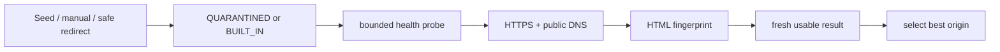

# Интеграция с Kinogo

Последнее обновление: **29 июля 2026 года**.

## Граница интеграции

Документированного публичного API сайта для всех нужных функций нет. Production-каталог,
авторизация и серверные закладки работают как обычный браузерный клиент:

- ограниченные HTTPS GET/POST;
- origin-scoped cookies;
- разбор server-rendered HTML и DLE responses;
- повторная авторизация на новом проверенном origin.

Закрытый JSON-шлюз официального Android-приложения не является основным backend приложения.
Он используется только как необязательный recovery path во время подготовки плеера.
Подробности снимка — в [`OFFICIAL_APP_RESEARCH.md`](OFFICIAL_APP_RESEARCH.md).

Сетевой протокол изменчив. Даты исследовательских наблюдений не означают, что endpoint
гарантирован сегодня; контрактные fixtures и live-проверка нужны после любого сбоя.

## Replaceable origins

Встроенные кандидаты в текущем коде:

```text
https://kinogo.parts
https://kinogo.online
```

Это bootstrap candidates, а не криптографическое доказательство «официальности». Их
доступность и service fingerprint проверяются во время работы.

`MirrorUrlNormalizer` принимает только origin:

- схема только `https`;
- без path, query, fragment и user info;
- порт только стандартный 443;
- без IP literals, localhost и reserved/local DNS suffixes;
- IDN нормализуется в ASCII.

## Жизненный цикл зеркала



- Manual и discovery candidates не trusted до успешной проверки.
- Redirecting origin не наследует доверие конечного origin.
- Безопасная конечная цель redirect добавляется как отдельный candidate и проходит отдельный
  probe.
- Health TTL — 6 часов.
- Refresh ограничивает количество и параллельность probes.
- Challenge/CAPTCHA, 401/403, geo restriction или DRM не являются поводом обходить защиту или
  бесконечно перебирать домены.

Сейчас discovery получает новые кандидаты только из ручного ввода и безопасных redirect
targets. Интернет-wide crawler и подписанный remote manifest ещё не подключены.

Ключевые файлы:

- `data/mirror/MirrorRegistry.kt`;
- `data/mirror/MirrorHealthChecker.kt`;
- `data/mirror/MirrorPreferencesStore.kt`;
- `data/network/ResilientPublicDns.kt`.

## HTTP-клиенты

`SafeHtmlClient` и `KinogoSessionHttpClient` выполняют:

- HTTPS/public-DNS destination validation;
- ограничение redirect;
- ограничение размера документа;
- проверку content type и service fingerprint;
- нормализацию terminal same-origin relative path;
- redaction чувствительных данных в диагностике.

Cookie jar разделён по origin. Cookies и password POST нельзя переносить через cross-origin
redirect. При смене зеркала `KinogoSessionManager` входит на новом origin сохранёнными
credentials.

## Каталог и поиск

Детерминированные GET-маршруты определены в `KinogoRoutes`:

| Назначение | Относительный путь |
| --- | --- |
| Главная | `/` |
| Фильмы | `/filmy/` |
| Сериалы | `/serialy/` |
| Мультфильмы | `/multfilmy/` |
| Аниме | `/anime/` |
| Поиск | `/search/{encoded term}/` |
| Следующая страница | `{base}page/{n}/` |

`KinogoHtmlParser` извлекает карточки, next-page, details metadata, description, player
notice и iframe candidates. ID и `relativePath` не должны включать active host.

Текущий `CatalogQuery` содержит section/search/page. Сортировка в `CatalogScreen` применяется
к уже загруженным карточкам. Серверные фильтры по жанру, стране, году и серверная сортировка
пока не моделируются: DLE применяет их через mutable POST/session state, который нужно
исследовать и формализовать отдельно.

При изменении HTML:

1. Сохранить минимальный redacted fixture без cookies и media tokens.
2. Добавить failing contract test.
3. Исправить parser, не UI.
4. Сохранить content-size/fingerprint boundary.
5. Выполнить live read-only проверку минимум двух страниц и одного поиска.
6. Обновить этот документ и `CHANGELOG.md`.

## Авторизация

Текущий HTML-flow:

```text
POST /
login_name=<login>
login_password=<password>
login=submit
```

Успешность определяется по авторизованному HTML (`dle_group != 5`); свежий
`dle_login_hash` используется там, где DLE требует user hash.

Credentials:

- постоянно сохраняются по продуктовому требованию;
- находятся в отдельном DataStore `kinogo_auth`;
- шифруются AES-256/GCM через non-exportable Android Keystore key;
- не входят в Android backup/device transfer;
- удаляются только явным действием пользователя.

Cookie session memory-only. Истёкшая или сменившая origin сессия восстанавливается через
сохранённые credentials.

## Серверные закладки

Статусная закладка меняется через DLE mylist:

```text
POST /engine/ajax/controller.php?mod=mylist
post_id=<DLE post id>&folder=watch|done|todo|drop|0
```

Соответствие:

| UI | Folder |
| --- | --- |
| Смотрю | `watch` |
| Смотрел | `done` |
| Буду | `todo` |
| Бросил | `drop` |
| Не смотрел | `0` / `status = null` |

«Не смотрел» удаляет material из статусных закладок. Оно не добавляет материал в огромный
список «всего непросмотренного» и не изменяет independent favorite.

Статусные страницы:

- `/favorites/watch/`;
- `/favorites/done/`;
- `/favorites/todo/`;
- `/favorites/drop/`.

Independent favorite читается с `/favorites/` и переключается DLE favorites action с
актуальным `user_hash`.

`LibraryStateStore` хранит server snapshot и coalescing outbox отдельно для status/favorite.
При конфликте pending локальная команда имеет приоритет до успешной отправки.

Подробный протокол и ограничения: [`AUTH_AND_SYNC.md`](AUTH_AND_SYNC.md).

## Прогресс просмотра

Точный Media3 checkpoint не является частью account protocol Kinogo. В текущей архитектуре:

- сайт синхронизирует status/favorite;
- TV хранит season/episode/voice/quality/position локально;
- iframe provider может отдельно хранить собственный localStorage, который не равен аккаунту
  сайта.

Не пытайтесь отправлять секунды воспроизведения в неподтверждённый endpoint.

## Обработка ошибок

UI должен показывать пользовательскую причину без URL, cookies и stack trace:

- нет рабочего зеркала;
- network timeout/unreachable;
- service fingerprint не совпал;
- challenge required;
- malformed/unsupported document;
- источник не найден или истёк.

Смена зеркала разрешена только для безопасных idempotent reads и повторной login-сессии.
Нельзя автоматически повторять пользовательскую mutation на другом origin без idempotency
или локального outbox.
